# Introduction to Statistical Genetics

```
$ echo "Data Sciences Institute"
```

---
# Learning Objectives

- This course provides an INTRODUCTION to concepts and fundamentals in statistical genetics.
- At the end of the course, I hope you will:
  - Understand foundational principles of population genetics.
  - Learn statistical methods commonly used in genetic data analysis.
  - Understand and apply computational and statistical methods used in the design and analysis of genome-wide studies.
  
---

# Course Content

- Background in molecular genetics and basic genetic models
- Concepts from population genetics
- Principles of inheritance
- Aggregation, heritability and segregation analysis
- Genome-wide association studies (GWAS) 
  - Quality control
  - Genotype imputation
  - Multiple testing
  - Meta-analyses  
  - Population stratification adjustment
  
---

# Background Needed

- Assume no formal training in genetics.
  - Basic concepts in molecular genetics will be introduced in the class.
- Familiarity with key concepts in statistical inference, including:
  - Elementary probability and statistical methods
  - Distributions of basic random variables (e.g., binomial, normal)
  - Likelihood-based methods: estimation and hypothesis testing
  - Basic regression techniques (e.g., linear, logistic)

---

# GitHub Repo

[https://github.com/UofT-DSI/gen_data/](https://github.com/UofT-DSI/gen_data/)

- Schedule
- These slides (PDF)
- All in-class code
- Assignment details and rubrics
- Policies, due dates, etc

---

# Online Resources

- **Textbook**: *The Fundamentals of Modern Statistical Genetics* (Nan Laird & Christoph Lange).

- **Introductory Genomics Videos**: [BigBio YouTube Channel – Genomics Playlists](https://www.youtube.com/c/BigBiovideos/playlists?app=desktop)

- Other useful resources beyond the scope of this course:
  - **Biomedical Data Resource Guide**: [StatsUpAI – Curated Biomedical Datasets](https://statsupai.org/datasets.html)

---


### What questions do you have about the course?

---

# What You’ll Learn Today

- **Foundations of genetic variation**
  - DNA → chromosomes → genes
  - Common variant types (e.g.,SNPs)

- **From variants to traits**
  - Mendelian vs. complex disease
  - Inheritance models: dominant / recessive / additive (genotype coding 0/1/2)

##### By the end of this lecture, you should be able to define alleles/genotypes, recognize common variant classes, explain penetrance, and map a coded genotype into a simple regression model.

-----

# What is Statistical Genetics?

- Statistical genetics is an interdisciplinary field at the interface between statistics and genetics and is concerned with the development of statistical methods for problems in genetics.
- Genetics is a subfield of biology concerned with the study of heredity (transmission of genetic material from parents to offspring) and genetic variation.

---

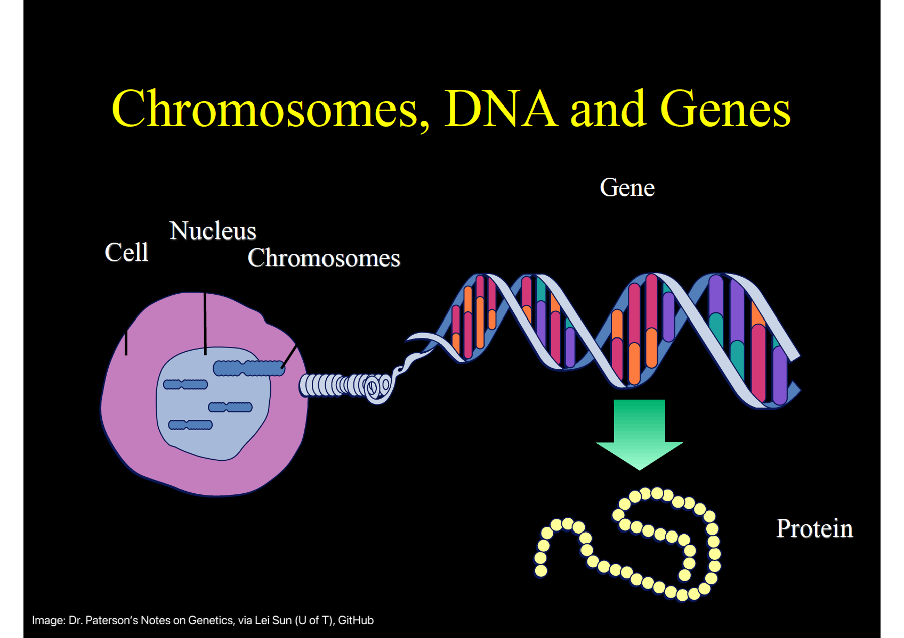

---
 # Deoxyribonucleic Acid (DNA)
 
- DNA is the basic biological material of inheritance; it determines how proteins are manufactured in the body
- Each strand of DNA is a long molecule made up of a linear sequence of subunits/base
pairs: A,T,G,C.
- A-T and G-C matching: information on one strand is sufficient.
- ‘Size’ of the genome: ≈ 3 billion of DNA base pairs
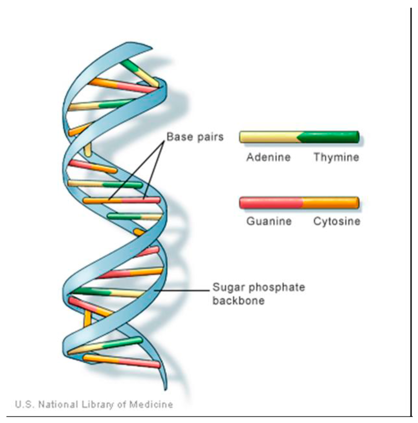

---

 # Deoxyribonucleic Acid (DNA) 
 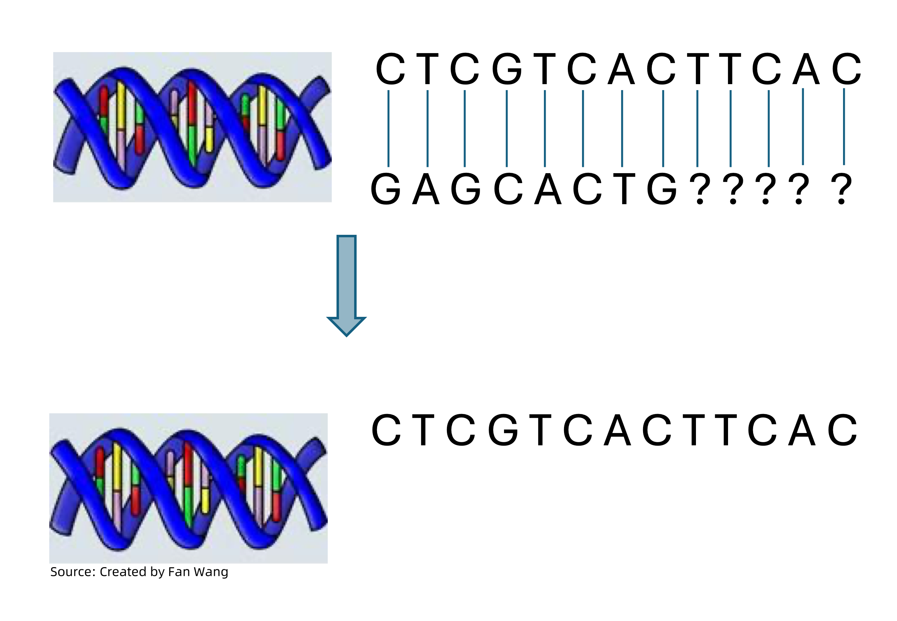 

___

 # Chromosomes 
 
- Each chromosome has a double helix structure: two long strands of DNA, bound to each other lengthwise. 
- 23 pairs of chromosomes: 22 homologous pairs (Autosomes) and 1 pair of sex chromosomes (XX female, XY male).
- In each pair, one copy is inherited from the mother and one from the father.
- Where genetic material is stored and in the nucleus of every cell.
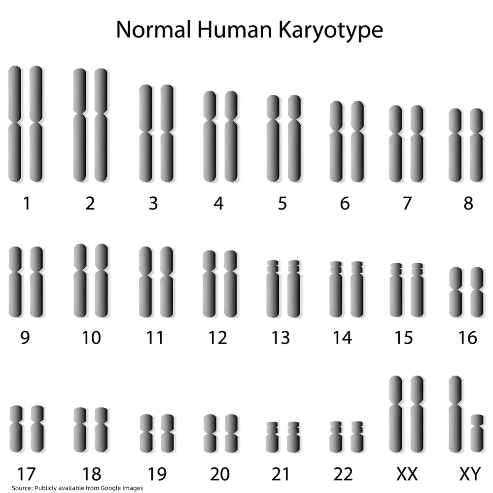
---

 # Double Helix Structure


- Each chromosome has two long strands of DNA.
- **Homologous chromosome pair**:

    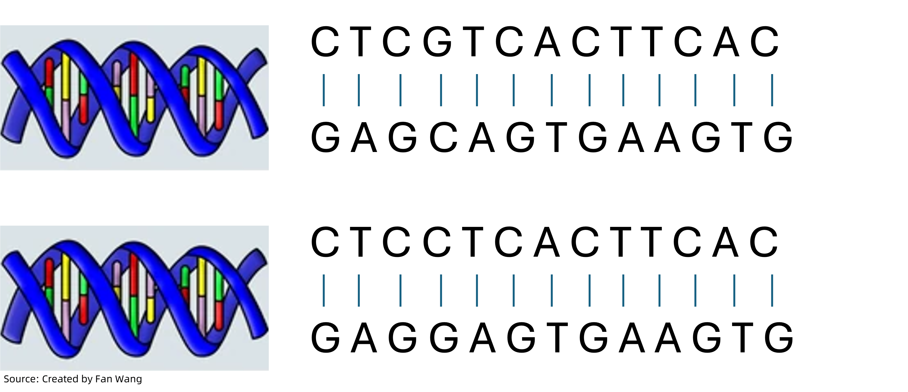 
 
---

 # Double Helix Structure
 
- Each chromosome has two long strands of DNA.
- **Homologous chromosome pair**:

    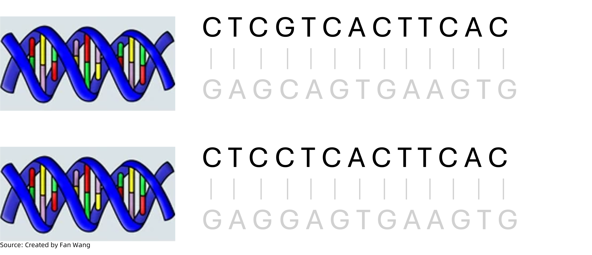 
 

---

# Human Genome
- 3 billion nucleotides (A,C,G,T) in the whole human genome.
  – Paired, double helix
- About 3 million of them differ between people (0.1% difference) - Genetic Variations.
- Most of these variations are in ‘junk DNA’.
  - Not directly code for proteins.
  - May have regulatory or unknown functions.
- Minority of these variations change how products of genes (proteins) behave.
- Scientists study which variations are linked to specific traits or diseases.

---

# Mutations 

- Mutations are **changes in DNA**.

  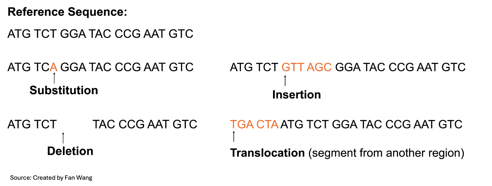

---

# Effects of Mutations 

- Mutations can be very detrimental to an organism.
  - May cause proteins to malfunction.
  - cells that rely on the proteins may not function properly.
  
- Most of these deleterious mutations remain rare in the population, because they are rarely transmitted to the next generation.

- Many of the mutations have no effect.
  - e.g., TCT and TCA both code for the same amino acid (protein building block), so changing one to the other has no impact.


---

# Mutations Give Rise to Genetic Variants

  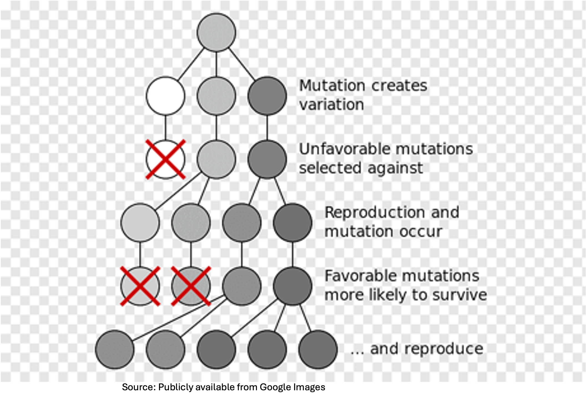

---

# Genetic Variants/Polymorphism

- A **polymorphism** is a part of DNA that can differ between individuals.
- These variations come from mutations that happened over long periods of human history.
- The different versions (or "states") of a polymorphism are called **alleles**.
- In statistical terms: a polymorphism is a random variable and an allele is one of the outcomes in the sample space.


---

# Types of Genetic Variants

- A **single nucleotide polymorphism (SNP)** is a type of genetic variation where a single nucleotide (A, C, G, or T) differs between individuals.
  - An **allele** at a SNP refers to one of the possible nucleotide bases — A, C, G, or T.

  - Appear about every 300 base pairs $\rightarrow$ ≈ 10 million SNPs.
  
    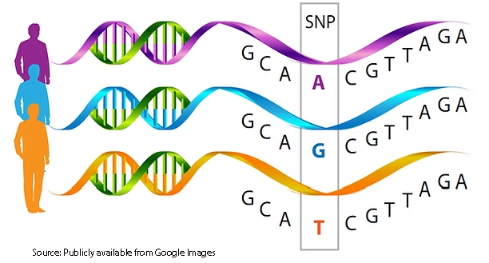

---

# Types of Genetic Variants

- **Variable number of tandem repeats (VNTR)**: Specific DNA sequences that are repeated immediately adjacent to each other for a variable number of times.
  - e.g. 16, 14 and 11 repeats of CA.
  - **Microsatellites** consist of small sequences (1-6) that are repeated.
  - The number of repeats can vary widely from one person to the next, therefore they are used often in forensic DNA and paternity testing, and in linkage mapping.
- **Indels**: extra base pairs (between 1 and 1000) can be inserted/deleted between two specific base pairs.
- **Structural variants**: duplications, deletions, inversions, translocations
- **CNV (copy number variants)**: large insertions/ deletions


---

# Types of Genetic Variants

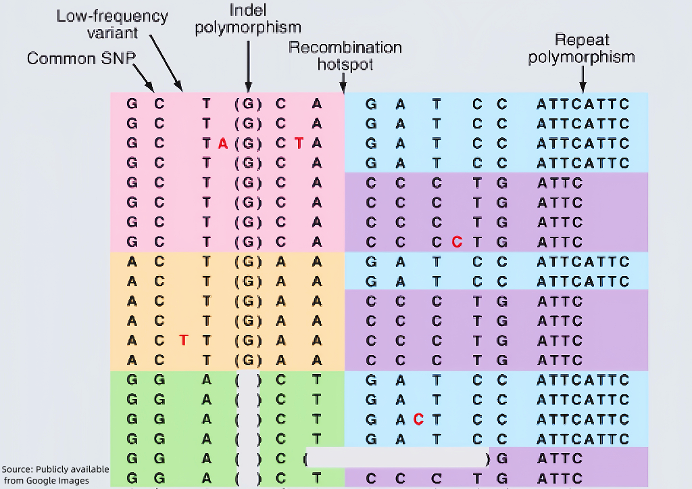

---


# Genes 
- A gene is an ordered sequence of nucleotides located in a particular position on a particular chromosome that **encodes a specific functional product** (a protein or RNA molecule).
- A gene is a segment of DNA consists of several coding segments (**exons**), separated by non-coding sequences (**introns**).
- Introns do not code for specific proteins, but they are not junk and may regulate exons.

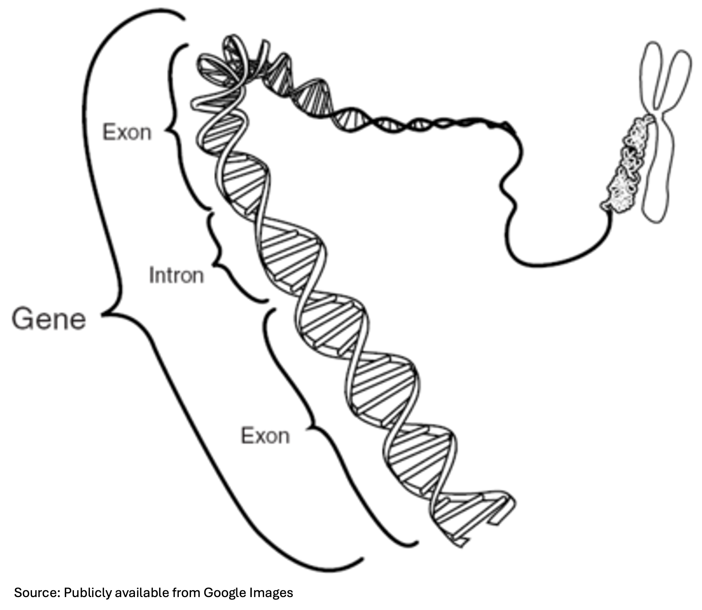

---
# Genes 
- **Gene sizes vary** from about 1K DNA base pairs to more than 1 million bp.
- About **20,000 - 30,000 genes** throughout the genome.
- Genes themselves do not directly affect traits.
- Proteins - the coded product of genes - are the ones influencing traits.
- Through the processes of **transcription** and **translation**, information from genes is used to make proteins. 
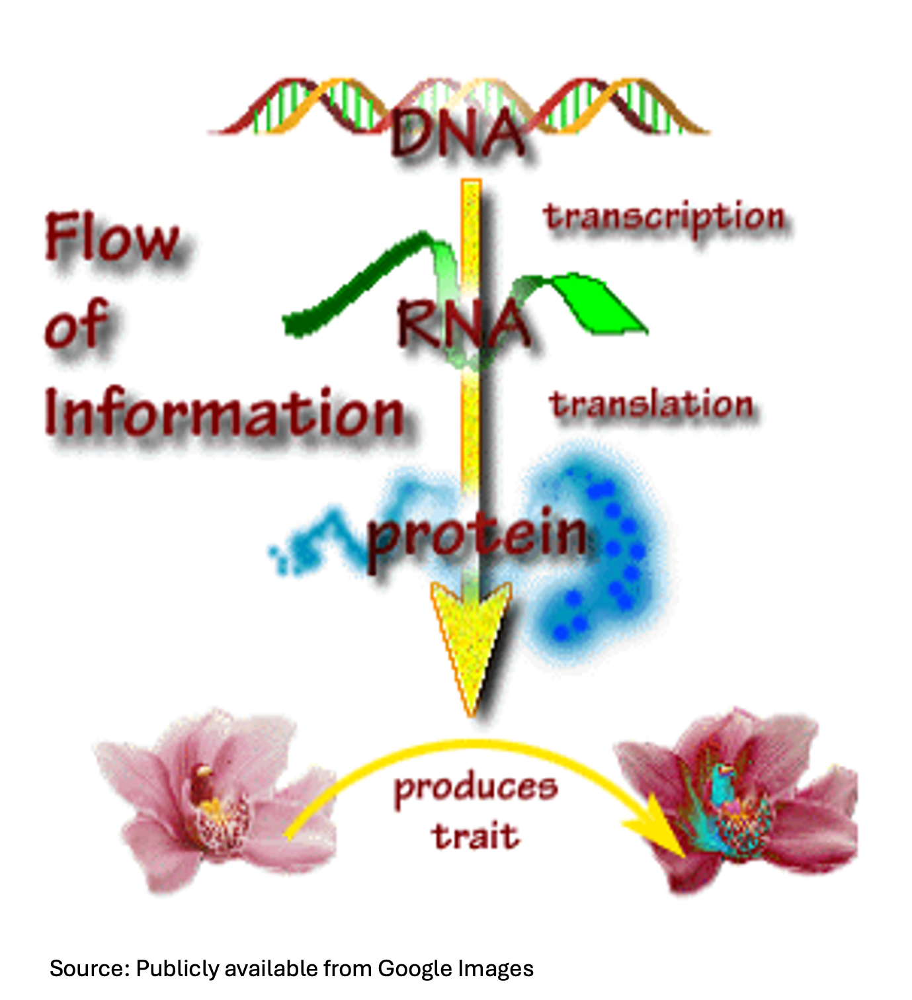

---

# Proteins

- Proteins are strings of amino acids.
- There are **20 different amino acids** that are coded by codons.
- A **codon** is a sequence of **3 letters** (nucleotides) in DNA or RNA.
- There are 64 possible codons (4 bases: A, T, C, G — and combinations of 3)
- Multiple codons can code for the same amino acid.
  - For example: TCT and TCA both code for Serine.
  - This redundancy helps protect against mutations.

---

# Codon Change Causes Sickle Cell Trait

- A Variant in the Hemoglobin Gene Causing Sickle Cell Anemia

    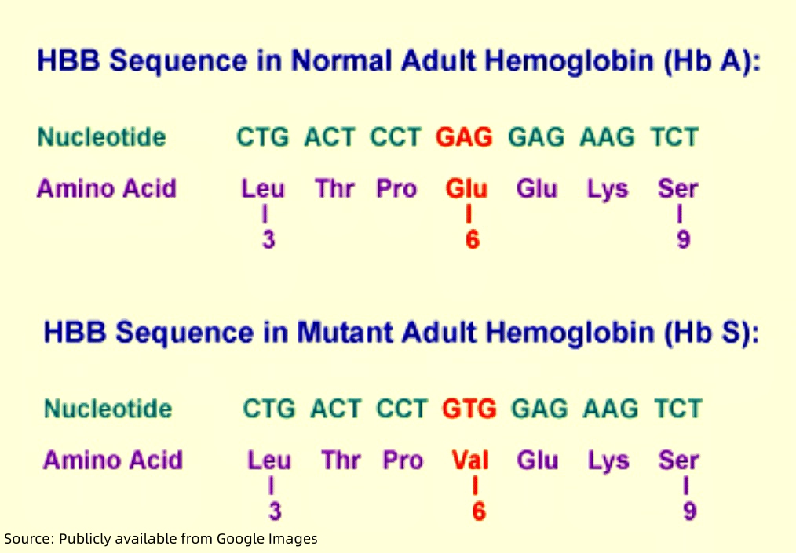 
 

---

# Alleles and Genotypes

**Genotype**: the two alleles at each chromosomal location (a pair of chromosomes) for a given individual.
  
- Most SNPs are bi-allelic; two alleles can be either G-C or A-T (matching).
- Could code them A (say for G-C) and a (for A-T).

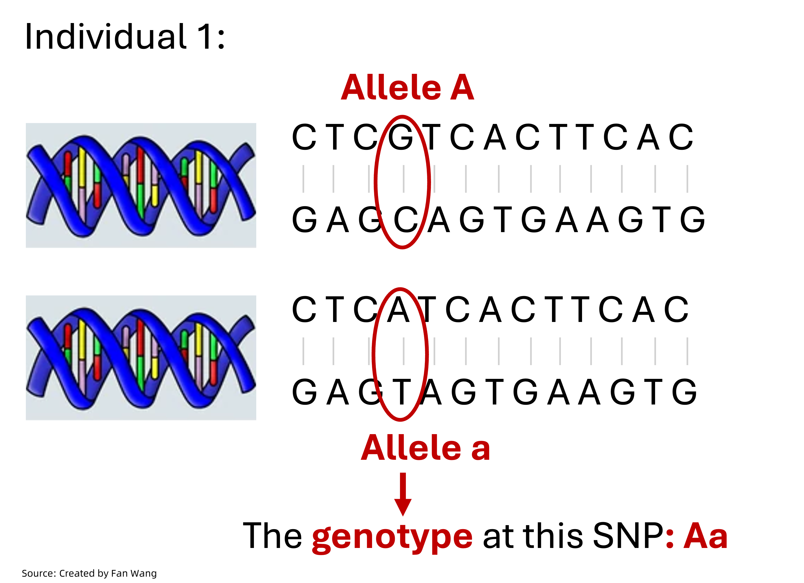

---

# Alleles and Genotypes

- A SNP with two alleles (A and a) has 3 possible (unordered) genotypes: AA, Aa/aA, aa.
- **Homozygous** genotype: same allelic type (AA or aa);
- **Heterozygous** genotype: different allelic type (Aa/aA).

    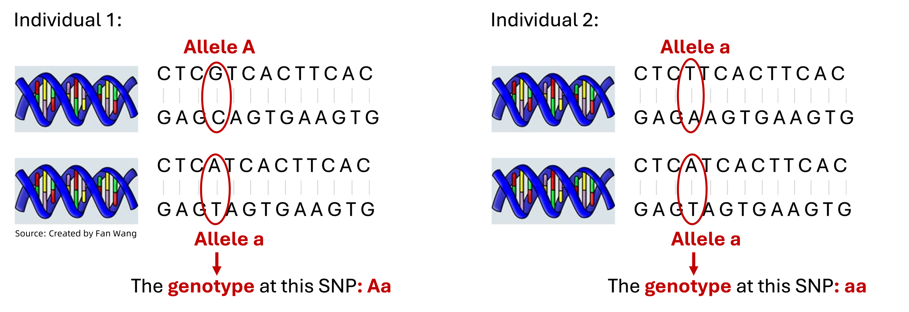

---

# Recap

- Human genomes and **paired** chromosomes
- DNA has double helix structure: a 4-letter (A-T, G-C) system.
- Variations/Mutations
  - polymorphisms/genetic variants ≡ discrete random variables
  - alleles ≡ outcomes of a random variable
  - **SNP** ≡ a r.v. with two outcomes
  - Microsatellite ≡ a random variable with typically 3-30 outcomes
    
- **Genotype** data of a polymorphism/genetic variant: paired alleles (from the
paired chromosomes.

---

# Mendel’s Inheritance Laws

- **Law of Segregation (The "First Law")**: every individual has two alleles and each parent passes a randomly selected copy to each of its offspring.
- **Law of Independent Assortment (The "Second Law")**: alleles/genes for different traits are passed independently (only true if the genes are not linked).

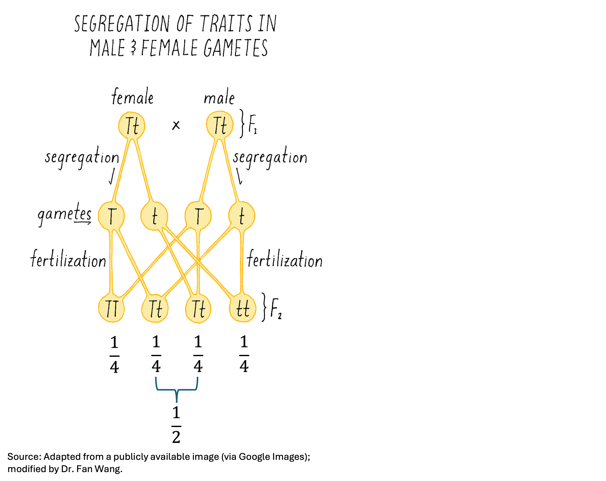
    
----

# Exercise 

If the father’s genotype is **dD** and the mother’s genotype is **dd**, what is the probability that an offspring’s genotype is dd, dD, or DD?


-----

# Application of Mendel’s First Law

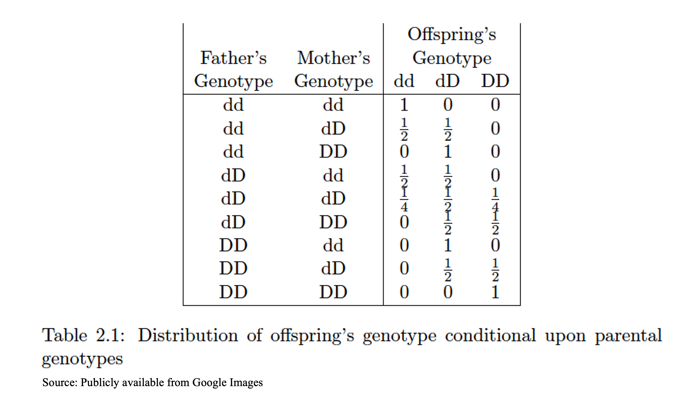


---
# Mendelian vs. Complex Diseases


 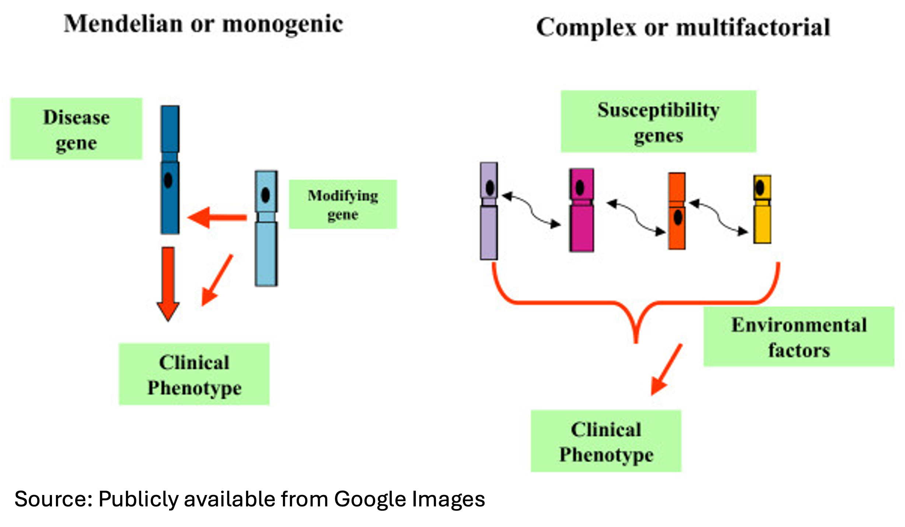
 
---

# Example of a Mendelian (rare) Disease

- <u>Sickle cell anemia</u>: Mendelian disease that affects red blood cells, i.e. red blood cells have a sickle (rather than round) shape which results in an abnormal blood flow, blocked blood vessels and severe anemia.
- Widely recognized as inherited disorder for centuries in sub-Saharan Africa because of the way it appeared in families.
- Laboratory studies showed that the sickle shape was due to a genetic variant that changed the molecular structure of hemoglobin.
- Interestingly, the variant that causes sickle cell anemia protects against malaria. This explains the high prevalence of this variant in the population despite its deleterious effect: balancing selection.

---

# Example of a Complex (common) Disease

- Alzheimer’s disease (AD) is a complex disorder with a strong genetic component, first described in 1906.
- Brain disorder with progressive destruction of brain cells leading to loss of memory and other cognitive impairment.
- Late onset (>65), but a small fraction of cases develop AD very early (late 30’s or 40s).
- Early onset AD is more likely to have a family history (familial AD).
- Over 200 rare variants in three genes have been reported in familial AD.
- Late onset AD is far more common: genetic causes (over 75 loci from GWAS), but also environmental risk factors such as head injury, high blood pressure, diabetes.

--- 

# Genetic Models

- A genetic model describes the relationship (usually probabilistic) between an individual’s genotype and their phenotype (or trait).
- Binary trait Y: affection status (Y=1 vs. Y=0).
- Continuous trait Y: quantitative phenotype (BMI, height, cholesterol).
- The genetic model can be deterministic (i.e. the genotype determines the phenotype exactly in Mendelian diseases). 
- Most often the model is probabilistic (i.e. the genotype influences the probability of disease: **P(Y|G) (aka penetrance function in genetics)**. 

---

# Simple Disease Models - Binary Traits

- $A, a$: the two alleles at a disease locus; $A$ is the risk allele.
- If the genetic locus has no effect on disease then $P(Y=1 \mid aa)=P(Y=1 \mid A a)=P(Y=1 \mid AA)$.
- **Dominant**: $P(Y=1 \mid AA)=P(Y=1 \mid A a)=1, P(Y=1 \mid a a)=0$.
- **Recessive**: $P(Y=1 \mid A A)=1, P(Y=1 \mid A a)=P(Y=1 \mid a a)=0$.
- These deterministic models **hold only rarely for simple Mendelian diseases**.
- More realistic are stochastic models with reduced penetrance and phenocopies.

---

# Simple Disease Models - Binary Traits

- Reduced penetrance: the probabilities above are less than 1.
  - e.g. in the recessive model $\mathrm{P}(\mathrm{Y}=1 \mid \mathrm{DD})<1$.

- Phenocopy means probability $P(Y=1 \mid d d)>0$ 
  - Disease can be caused by a different genetic locus than the one under consideration.
  
- **Additive** if the penetrance of the heterozygous genotype is midway between the two homozygous genotypes.

---

# Penetrance Function for a Binary Trait

 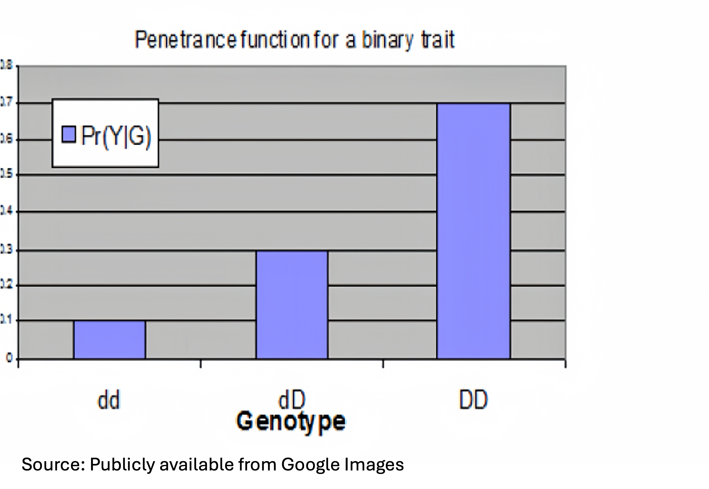

---

# Quantitative Traits

- For **quantitative traits**: a natural choice for the penetrance function is a normal density with a mean depending on the genotype. 
- A more general approach uses a generalized linear model (GLM):
$$
g(E(Y \mid X))=b_0+X^{\prime} b_1, ~\text{where}~ g ~\text{is the link function.}
$$

- <u>Logistic</u> function for binary traits: $\log \frac{E(Y \mid X)}{1-E(Y \mid X)}=b_0+X^{\prime} b_1,$
- <u>Identity function</u> for continuous traits: $E(Y \mid X)=b_0+X^{\prime}b_1$
- X (the coded genotype) reflects the mode of inheritance.
- Test for genetic effect: $H_0: b_1=0$ ( $b_1=$ effect size).


---

# Penetrance Function for a Continuous Trait

 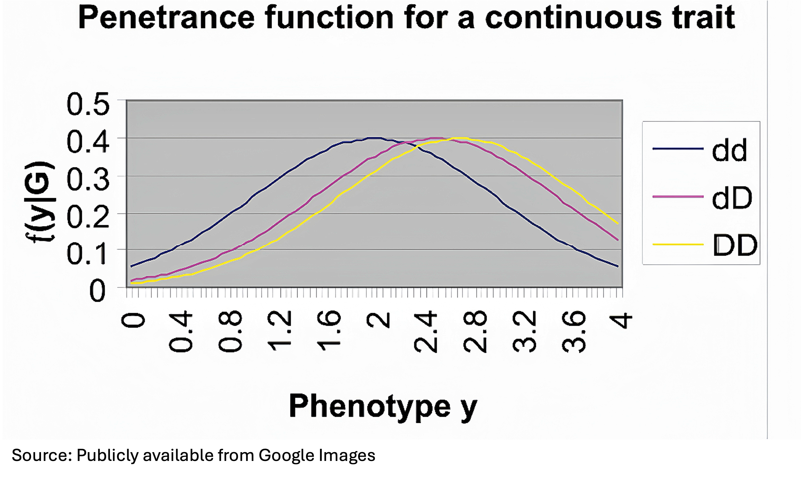

---

# Genotype Coding

 

---

# What's Next
- Fundamental principles of population genetics
- Estimation of allele frequency
- Population substructure
- Hardy–Weinberg equilibrium
- Mode of inheritance
- Association testing

### What questions do you have about anything from today?


