# Population Genetics

```
$ echo "Data Sciences Institute"
```

---

# What You’ll Learn Today 

- **Population structure & why it matters:** Stratification, admixture, and inbreeding - how they alter genotype proportions and can bias association results.
- **Allele frequencies & Hardy-Weinberg equilibrium (HWE):** How to estimate allele frequency, derive expected genotype counts under HWE, and interpret/test departures (HWD).
- **Variance inflation & interpretation:** How population structure inflate HWE test and implications for study design/quality control.
- **Tutorial I: Navigating the genetic dataset**
----

# Population Genetics

- A field concerned with genetic variation within and between populations over time and space.
- By looking at genetic variation we can learn about  population history, migration patterns, and the impact of natural selection on genetic diversity.


---

## Factors that affect patterns of genetic variation

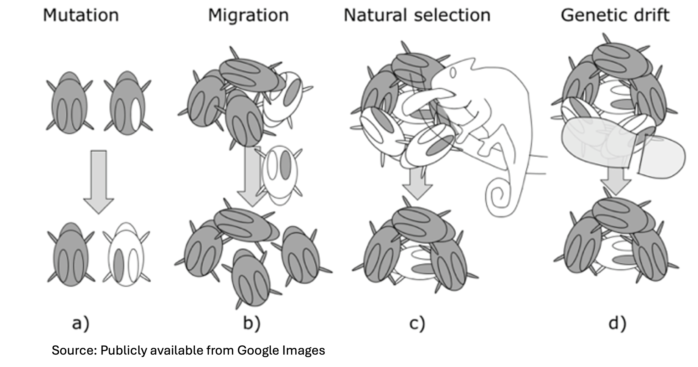 
    
- By looking at genetic variation we can learn about  **population history**, **migration patterns**, and the **impact of natural selection on genetic diversity**.


---
## Bottleneck Effects

- Natural events like a disaster that kills **at random** a large portion of the population can change the genetic structure of the population.

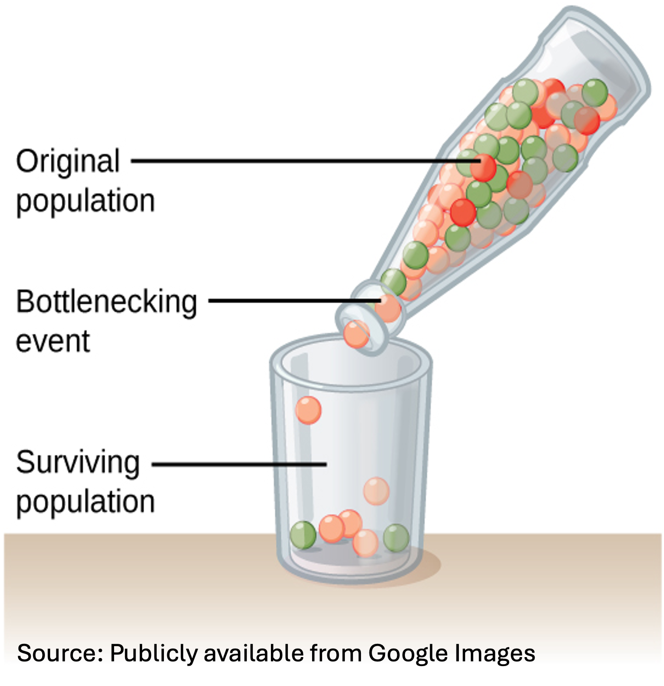

---
## Founder Population

- A founder effect occurs when a new colony is started by a few members of the original population.
- For example, the Amish community in Pennsylvania. This population is descended from around 200 German immigrants who started their colony.

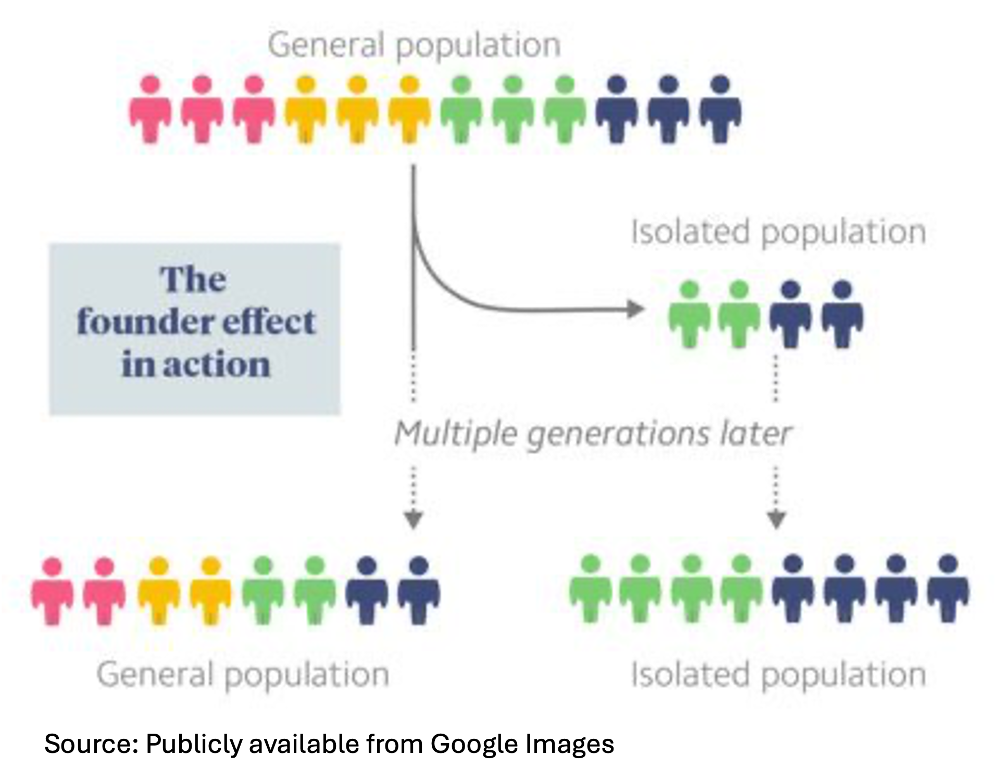


---

# Important Concepts
- Key principles in population genetics that are important in association analysis: 
  - Population substructure
  - Hardy-Weinberg equilibrium (HWE)
  - Population substructure can lead to Hardy-Weinberg disequilibrium (HWD).

---

# Estimation of Allele Frequency

- An individual has two copies of each autosomal (non‑sex) chromosome.
   
    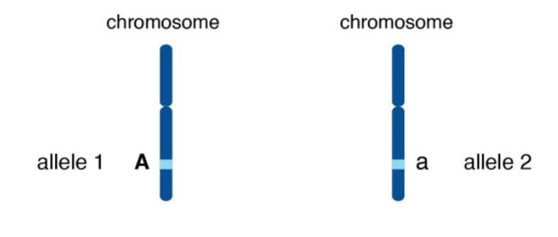 
     
- Goal: estimate the population proportion of a particular allele A (the other allele is a).

---

# Estimation of Allele Frequency

- The allele proportion (frequency) in the population is the proportion of chromosomes carrying that allele.
- Suppose we have a sample of n individuals from a population with a proportion p of A alleles.
- We want to estimate p.
- q = 1−p is the frequency of the other allele, a.

---

# Estimation of Allele Frequency

- $n_{AA},n_{Aa},n_{aa}$ = number of individuals with genotype AA, Aa, aa.
- $n=n_{AA}+n_{Aa}+n_{aa}$
- $\hat{p}=\frac{2 n_{AA}+n_{Aa}}{2n}$ 
- $\hat{q}=1-\hat{p}$

---

# Estimation of Allele Frequency

- $\hat{p}$ is an unbiased estimator of $p$ when the sample is a **random sample with equal probability sampling** (each individual in the population has the same probability of being included).

- In practice, this means the probability of selection in the sample does not depend on genotype directly or indirectly through a phenotype related to genotype.
  - E.g., some genotypes might be overrepresented if you only sample people with a disease linked to the allele.

- Standard error for proportion $\sqrt{\hat{p}(1-\hat{p})/2n}$ assumes independence -- may not hold.
  - E.g., family-based or structured populations

---

# Visualizing the Geography of Genetic Variants

- [http://popgen.uchicago.edu/ggv/](http://popgen.uchicago.edu/ggv/)
  
    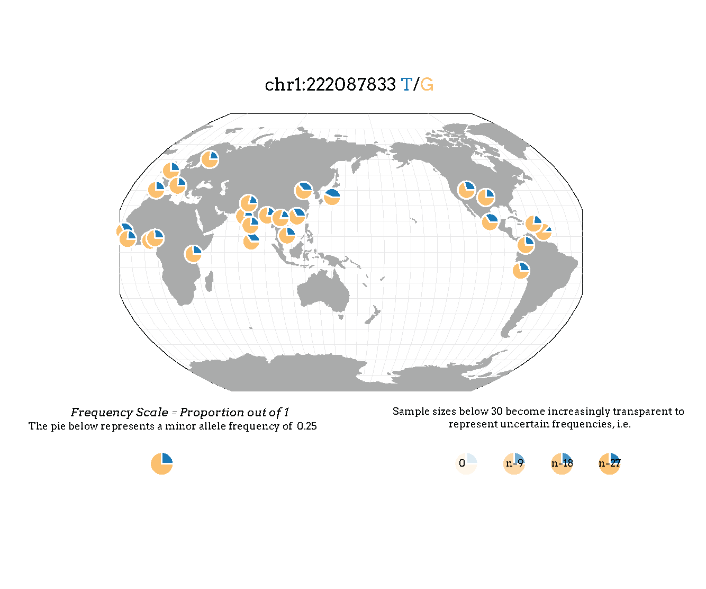 

___

# Population Substructure

- Different subgroups present within your population 

    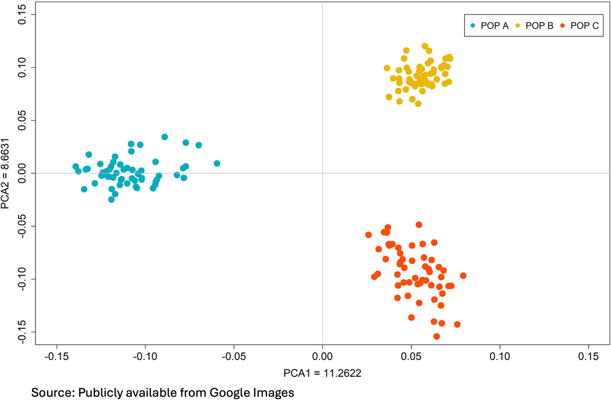 

---

# Population Substructure

## Three common types of population substructure

- Population stratification
- Population admixture
- Population inbreeding


---

# Population Stratification

- Simplest form of population substructure.
- Individuals in a population can be divided into disjoint strata.
- Strata: ethnic, racial, or geographic groups.
- Allele frequencies can vary among strata.
    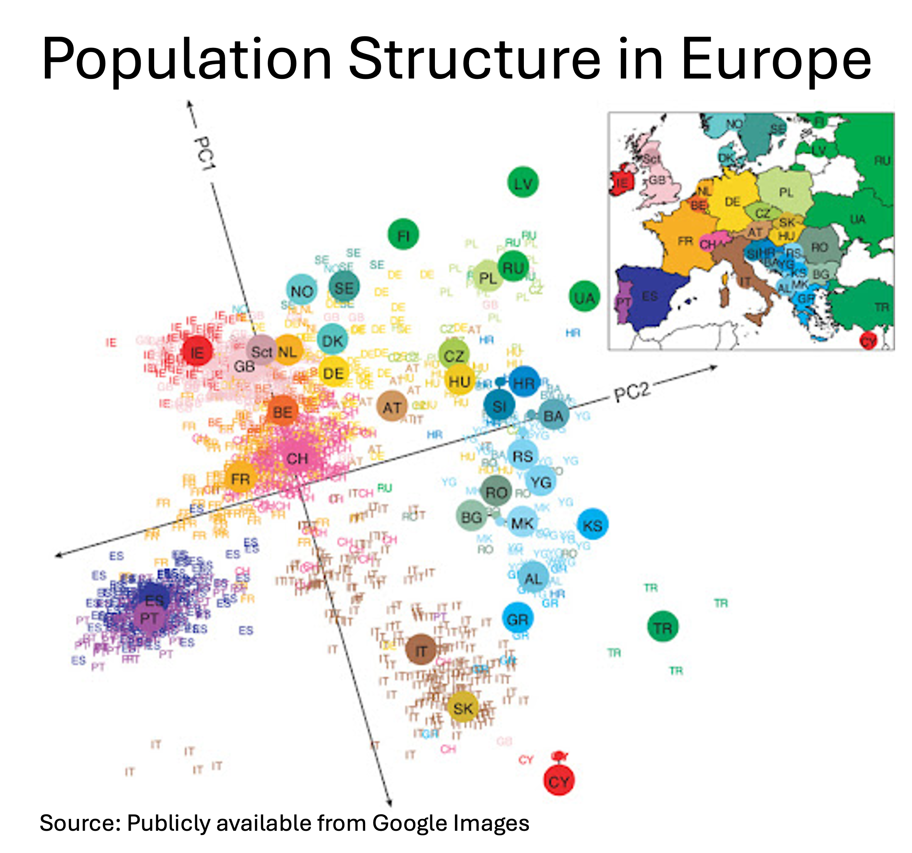

---

# Population Admixture
- Individuals in a population have a mixture of different genetic ancestries due to mixing of two or more populations in the past.
- E.g., Hispanic populations:

    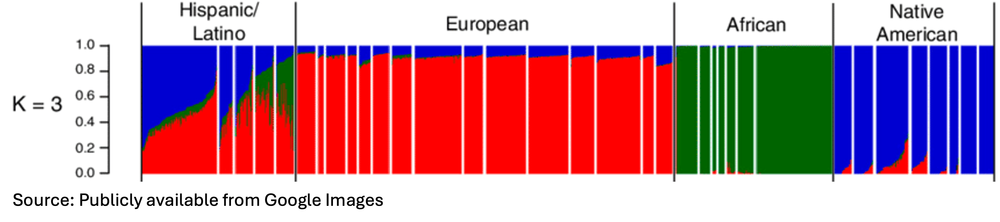 

---

# Population Admixture

- If allele frequency differs between these populations, then the probability that an individual carries an allele depends on the mixture of that individual’s ancestry.

- If disease rates differ across populations, **spurious associations** can arise.

  - E.g., Allele frequencies and the percentage with diabetes, stratified by the number of great grandparents from a hypothetical ancestral group (population X):

  -   | Population X Heritage | Gm3;5;13;14% |  % Diabetes |
      |------------|------------------------|-------|
      | 0 |    65.8% | 18.5%   |
      | 4 |  42.1%   | 28.6%    |
      | 8 | 1.6%    | 39.2%   |
  
---

# Population Inbreeding 

- A preference for mating among relatives, or geographic isolation, restricts mating choices.
   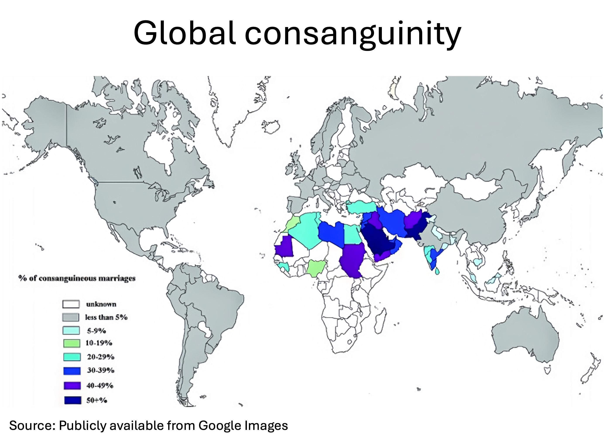 

---

# Inbreeding Coefficient

- The inbreeding coefficient:
     $F$ = probability that a random sampled individual in a population inherits two copies of the same allele from a common ancestor.
- In large, randomly mating populations, $F=0$.

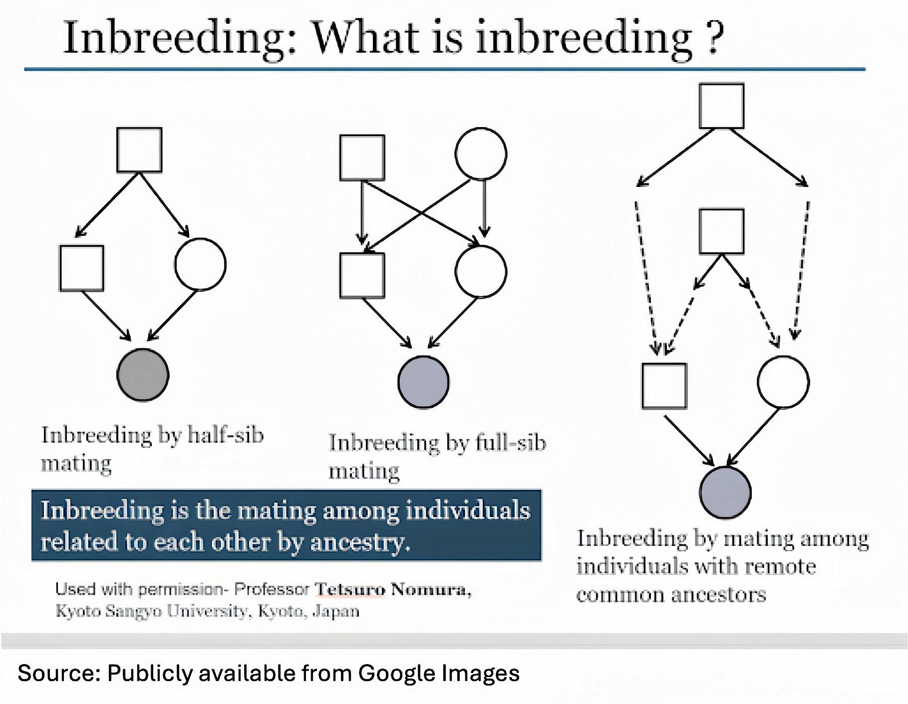 


---

# Population Inbreeding 

- Inbreeding tends to **increase the number of homozygotes** in a population, and so inbred populations tend to a **higher‑than‑expected frequency of rare recessive disorders**. 

 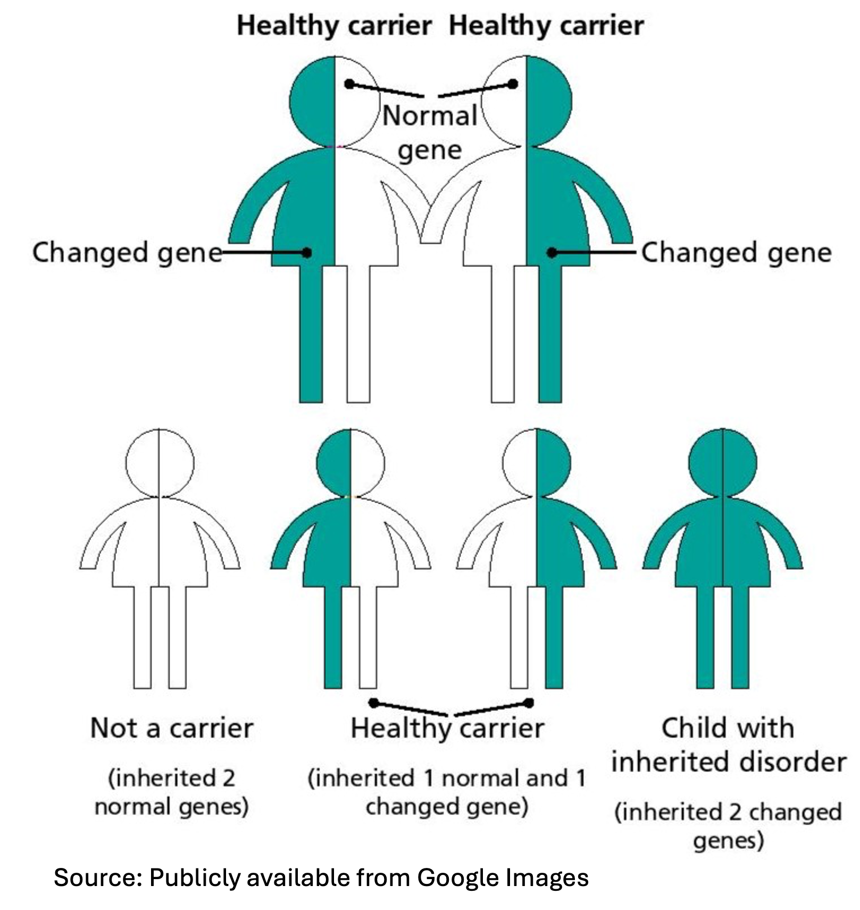 

---

# Hardy-Weinberg Equilibrium (HWE)

- In 1908, Hardy and Weinberg independently derived a formula relating the genotype frequencies in offspring to allele frequencies in parents.

- The genotype distribution at a locus is defined by the allele frequencies.

- Assumptions: random mating, no inbreeding, no selection, no mutation, no migration, infinite population size.

- HWE simplifies statistical theory and is often assumed.

---

# Hardy-Weinberg Equilibrium

- Let **$p$** be **the frequency of the A allele**.
- After one generation of random mating: 
$𝑃(𝐴𝐴)=p^2$, $𝑃(𝐴𝑎)=2𝑝𝑞$, $𝑃(𝑎𝑎)=𝑞^2$.
- Thus, with random mating, the number of A alleles in the offspring generation $\sim 𝐵𝑖𝑛(2,𝑝)$.
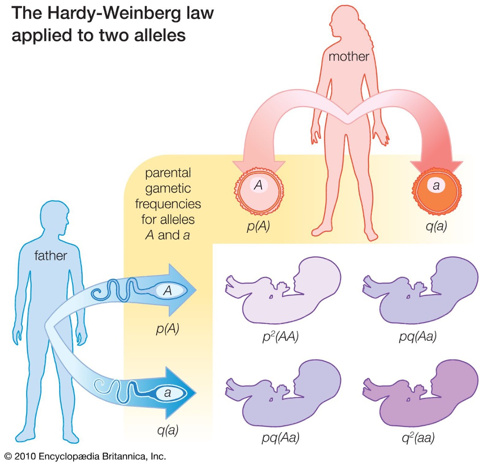


---

# Testing for HWE
- Common first step in any genetic analysis.
- $𝐻_{0}$: HWE holds.  Vs  $𝐻_{1}$: HWE does not hold.
- Compare the observed genotype frequencies with those expected under HWE (under $𝐻_{0}$).

---

# Testing for HWE
- **The Pearson Goodness of Fit Test for HWE**:
- $𝐻_{0}$: HWE holds;  vs.  $𝐻_{1}$: HWE does not hold.
- Given a sample size $n$ from the population:

- |            | AA                     | Aa    | aa    |   |
  |------------|------------------------|-------|-------|-------|
  | **Observed** | $n_{AA}$               | $n_{Aa}$ | $n_{aa}$ | $n$    |
  | **Expected** | $n\bar{p}^2$           | $2n\bar{p}\bar{q}$ | $n\bar{q}^2$ | $n$    |
- $\bar{p}=\left(2 n_{A A}+n_{A a}\right) /(2 n).$
- $T=\sum^{3}_{i=1} \frac{\left(O_i-E_i\right)^2}{E_i}$; $T \sim \chi^2_{(1)}$ under $H_{0}$.

---

# Exercise

- Assume you observe that the proportion of a population affected with sickle cell anemia is 0.01. Assuming an autosomal recessive disease model and HWE, estimate the frequency of the sickle cell mutation at the hemoglobin locus in this population.

---

# Exercise

- **Autosomal recessive disorder** $\rightarrow$ affected = homozygous recessive (AA)
- Under HWE, $p^2=$ Frequency of affected individuals $=0.01$ $\rightarrow p=\sqrt{0.01}=0.1$.
- Frequency of normal allele $(\mathrm{a})=q=1-p=0.9$
- Genotype distribution under HWE:
  - Homozygous sickle cell (AA): $p^2=0.01$
  - Heterozygous carriers (Aa): $2 p q=2 \times 0.1 \times 0.9=0.18$
  - Homozygous normal (aa): $q^2=0.81$
---


# Exercise - Testing HWE

- |    Genotypes        | AA                     | Aa /aA   | aa |  Total |
  |------------|------------------------|-------|-------|-------|
  | **Observed counts** | 9               | 89 | 189| 287  |
  | **Expected counts** |  | | |287|
  | **Expected freq.** |  0.01| 0.18| 0.81  | 1|

- $T=\sum^{3}_{i=1} \frac{\left(O_i-E_i\right)^2}{E_i} \sim \chi^2_{(1)}$ under $H_{0}$.

---

# Exercise - Testing HWE

- |    Genotypes        | AA                     | Aa /aA   | aa |  Total |
  |------------|------------------------|-------|-------|-------|
  | **Observed counts** | 9               | 89 | 189| 287  |
  | **Expected counts** |  $0.01×287 \approx 2.9$ | $0.18×287 \approx 51.7$| $0.81×287 \approx 232.5$ |287|
  | **Expected freq.** |  0.01| 0.18| 0.81  | 1|

- $T=\sum^{3}_{i=1} \frac{\left(O_i-E_i\right)^2}{E_i}= \frac{(89-51.7)^2}{51.7}+\frac{(9-2.9)^2}{2.9}+\frac{(189-232.5)^2}{232.5}=47.88$.
- P-value = $4.53×10^{−12}$; reject HWE. 


---

# Why does HWE fail?

- Rejecting the HWE provides some evidence that HWE does not hold – **Hardy-Weinberg disequilibrium (HWD)**.
- Many reasons for HWD: **population substructure**, **selection**, **genotyping error**, **association with trait in case-control design**.
- At a disease locus we usually have HWD in cases: if a minor allele homozygous confers greater risk to disease, selecting individuals with disease results in more homozygous and less heterozygous than expected. 
- With population substructure or inbreeding, heterozygous individuals tend to be underrepresented relative to HWE.
- In GWAS we use the HWE test in controls only to identify variants which might be problematic. 

---

# Population Structure and Genotype Distributions

#### With population structure, we have variance inflation relative to HWE.

- Consider a population divided into $K$ subgroups (strata).
- Each stratum $k$ has its own allele frequency $p_{k}$ and stratum frequency $s_k$.
- Assumes HWE holds within each stratum.

- |            | Stratum       | S | AA | Aa |  aa |
  |------------|-------|-------|-------|-------|-------|
  | 1 | $s_{1}$ | $p_{1}$ | $p^2_{1}$| $2p_{1}q_{1}$| $q^2_{1}$ |
  | 2 | $s_{2}$ | $p_{2}$ | $p^2_{2}$| $2p_{2}q_{2}$| $q^2_{2}$ |
  | ... | ... | ... | ... | ... | ... |
  | K | $s_{K}$ | $p_{K}$ | $p^2_{K}$| $2p_{K}q_{K}$| $q^2_{K}$ |
  

---

# Population Stratification and Genotype Distributions

- Overall allele frequency in the combined sample: $p=\sum_{k=1}^K s_k p_k.$
- Variance of allele count per individual:
  $$\operatorname{Var}(X)=2 p q+2 \operatorname{Var}\left(p_k\right)>2 p q$$
- Thus, with **population stratification**, var(X) is **inflated**.
- When $var(p_{k})=0$, there is no variance inflation. 

---
# Derivations

- Under HWE in stratum k :
  - Mean allele count: $\mathrm{E}[X \mid k]=2 p_k.$
  - Variance within stratum: $\operatorname{Var}(X \mid k)=2 p_k q_k, q_k=1-p_k.$
- Law of total variance: $\operatorname{Var}(X)=\mathrm{E}[\operatorname{Var}(X \mid k)]+\operatorname{Var}(\mathrm{E}[X \mid k]).$


- Within-strata variation:
$$
\mathrm{E}[\operatorname{Var}(X \mid k)]=\sum s_k 2 p_k q_k.
$$

- Between-strata variation
$$
\operatorname{Var}(\mathrm{E}[X \mid k])=\operatorname{Var}\left(2 p_k\right)=4 \operatorname{Var}\left(p_k\right).
$$

- Combine: $\operatorname{Var}(X)=2 \sum s_k p_k q_k+4 \operatorname{Var}\left(p_k\right).$
---
# Derivations

- $\operatorname{Var}(X)=2 \sum s_k p_k q_k+4 \operatorname{Var}\left(p_k\right).$

- $\sum_k s_k p_k q_k=\sum_k s_k p_k\left(1-p_k\right)=\sum_k s_k p_k-\sum_k s_k p_k^2=p-\mathrm{E}\left(p_k^2\right).$
    
    $=p-\left(\operatorname{Var}\left(p_k\right)+p^2\right)=p q-\operatorname{Var}\left(p_k\right).$

- Thus, $\operatorname{Var}(X)=2 p q+2 \operatorname{Var}\left(p_k\right)$. 

---

# Population Inbreeding and Genotype Distributions

- With inbreeding there is a positive probability that an individual inherits the exact same A (or a) allele from both parents.
- The inbreeding coefficient F = P(a randomly sampled individual inherits the same copy from both parents).
  - With probability F, the two alleles are **identical by descent** (IBD).
  - With probability 1−F, they are drawn independently from the gene pool (HWE frequencies).
---

# Derivations
- $P(A A) =P(X=2)=F p+(1-F) p^2$
- $P(A a) =P(X=1)=2 p q(1-F)$
- $P(a a) =P(X=0)=F q+(1-F) q^2$


- $E(X)=2 p$.
- $\operatorname{Var}(X)=4\left[F p+(1-F) p^2\right]+2 p q(1-F)-4 p^2=2 p q(1+F)$.
- Var(X) is inflated relative to the variance under HWE!

---

# Measuring the Departure of HWE
- An estimate of the inbreeding coefficient is **$\hat{F}=1-O / E$**.

- O is the number of heterozygotes and E is the expected number of heterozygotes based on HWE.

- With inbreeding, F should be positive.

---

# Recap

- Bottlenecks and founder effects: Events that reduce genetic diversity or create isolated groups can lead to allele frequency differences between populations.

- Hardy–Weinberg equilibrium (HWE): Predicts genotype frequencies under random mating; deviations can indicate factors like substructure, selection, inbreeding, or genotyping errors.

- Population structure: Stratification and admixture can cause allele frequency differences between subgroups, while inbreeding increases homozygosity within subpopulations. All three factors can alter genotype proportions relative to HWE expectations.

---

# Recap: Simple Disease Models 

- $A, a$: the two alleles at a disease locus; $A$ is the risk allele.
- If the genetic locus has no effect on disease then $P(Y=1 \mid aa)=P(Y=1 \mid A a)=P(Y=1 \mid AA)$.
- **Dominant**: $P(Y=1 \mid AA)=P(Y=1 \mid A a)=1, P(Y=1 \mid a a)=0$.
- **Recessive**: $P(Y=1 \mid A A)=1, P(Y=1 \mid A a)=P(Y=1 \mid a a)=0$.
- These deterministic models **hold only rarely for simple Mendelian diseases**.
- More realistic are stochastic models with reduced penetrance and phenocopies.

---

# Recap: Simple Disease Models 

- Reduced penetrance: the probabilities above are less than 1.
  - e.g. in the recessive model $\mathrm{P}(\mathrm{Y}=1 \mid \mathrm{DD})<1$.

- Phenocopy means probability $P(Y=1 \mid d d)>0$ 
  - Disease can be caused by a different genetic locus than the one under consideration.
  
- **Additive** if the penetrance of the heterozygous genotype is midway between the two homozygous genotypes.

---

# Recap: Genotype Coding

 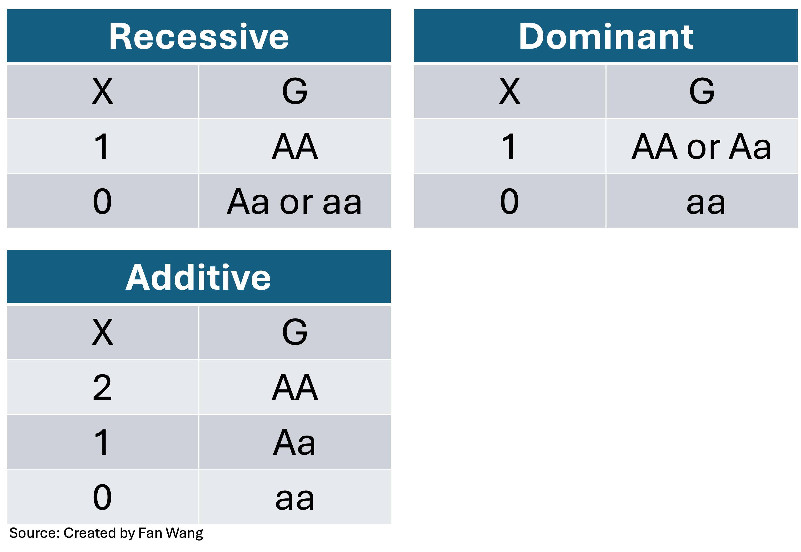


---
# Tutorial I: Navigating the Genetic Dataset

- The goal is to help beginners understand how genotype data is stored and accessed (in PLINK), and prepare them for downstream tasks like GWAS and QC.

- Introduces the structure, content, and usage of PLINK binary genotype datasets, using a toy dataset with 4,000 individuals and more than 300K SNPs in PLINK. 

---

# What's Next: Genetic Association Studies

- Part 1: Given a trait, should we perform genetic studies and under what conditions?

- Part 2: Association tests 


---

## How do we know a trait is genetic?

- Most researchers would not undertake a genetic analysis without enough evidence.

- Family Studies: traits that run in families suggest genetic influence.
    
- **Heritability** estimates: statistical models can estimate what proportion of variance in a trait is due to genetic factors.
    
- Genetic association studies: identifying specific genetic variants (SNPs, genes) that are statistically associated with the trait.
    
---

# Heritability

- Heritability analyses are designed to show that diseases, or phenotypes more generally, have a genetic basis.
- Q: what proportion of the total phenotypic variation in a population can be attributed to genetic factors, as opposed to environmental or random factors?


---

# Heritability

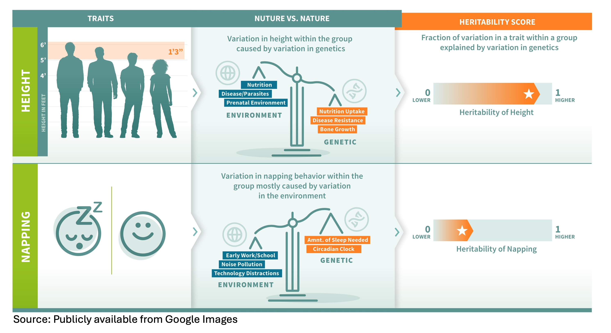 

---

### What questions do you have about anything from today?

