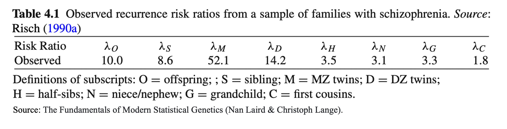
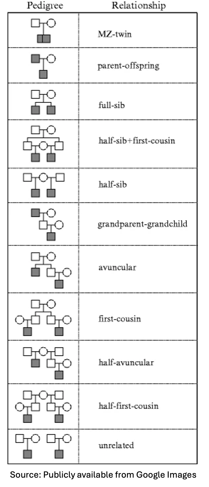
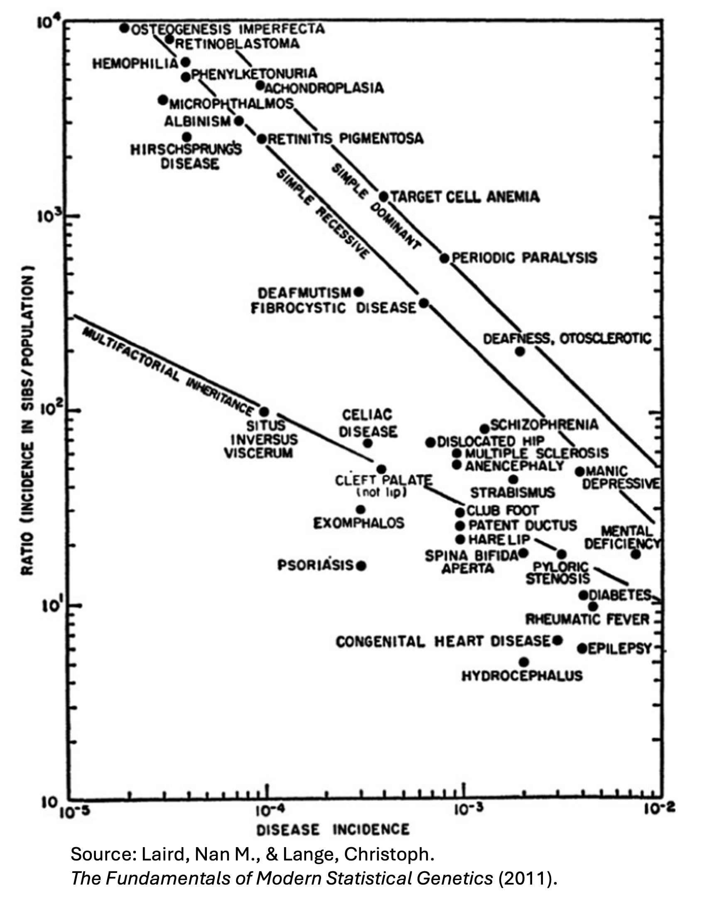
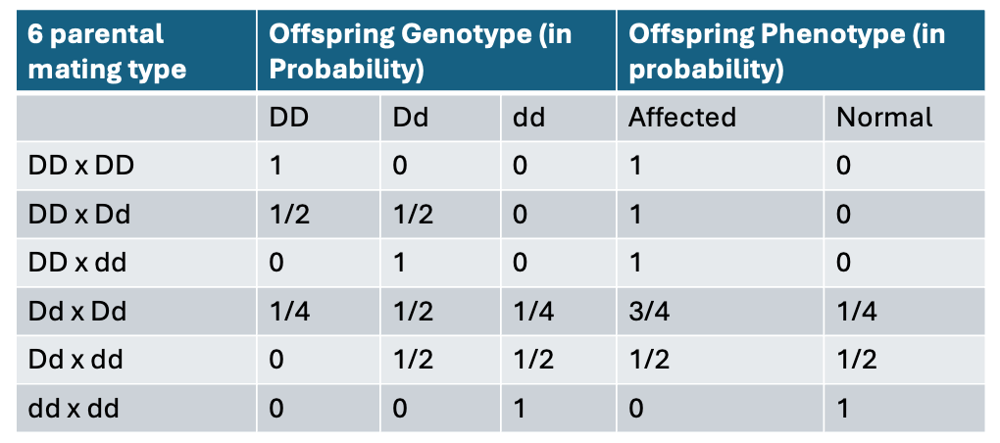

# Aggregation Analysis, Heritability and Segregation Analysis

```
$ echo "Data Sciences Institute"
```

---

# What You’ll Learn Today 

- **Aggregation & recurrence risk:** Detect familial clustering in binary traits and compute and interpret the recurrence risk ratio.
- **Heritability concepts & estimation:** Partition phenotypic variance and estimate heritability using twin studies.
- **Segregation analysis:** Test Mendelian transmission models (dominant or recessive) using family data, and account for ascertainment bias in study design and interpretation.

-----

### Part 1: Given a trait, should we perform genetic studies and under what conditions?
  
- Most researchers would not undertake a genetic analysis without enough evidence

<br>

#### Problem: Only phenotypes are observed — how to disentangle genes vs. environment?

- Approach: Analyze how similar relatives are to one another for the trait of interest.
  - Strong similarity suggests high genetic contribution (high heritability).
  - Weak resemblance indicates greater environmental effects (low heritability).


---

# Twin Brain Gray Matter Correlation

- Identical twins show much higher gray matter correlation than fraternal twins, highlighting a strong genetic influence on brain structure.


---

# Aggregation & Heritability Analyses
  
- Aggregation analyses – for binary traits
- Heritability analyses – for quantitative traits
  
- Aim: Demonstrate that diseases or other phenotypes have a **genetic basis** by examining patterns of **phenotypic correlation among relatives** (or clustering within families).

- Approach: Model phenotypic data from families or pedigrees **without using genetic marker data**.

- Developed when genotyping was costly, labor-intensive, and not widely accessible.

- Newer approaches are more popular, e.g. use population GWAS data (without pedigrees) to estimate heritability.

---

# Aggregation Analysis

- Binary traits (e.g. affected/unaffected)

- Core idea: genetic material is inherited in families.

- If the phenotype of interest has a genetic component, the relative of an affected subject will have a higher predisposition to disease than an unrelated subject in the general population, because of the shared genetic material among relatives.

---

# Recurrence Risk Ratio

- Recurrence risk ratio measures the strength of the genetic aggregation among relatives.

- It is defined as a probability ratio which compares the probability of a study subject being affected given that a relative is affected to the general risk in the population (i.e. the prevalence).
$$ 
\lambda_R=\frac{P\left(Y_2=1 \mid Y_1=1\right)}{K}, ~\text{where}~ K=P(Y=1).
$$
  
---

# Recurrence Risk Ratio

- We expect that first degree relatives (siblings, parent-offspring pairs) will have a larger recurrence risk ratio than will second or third degree relatives, or mother/father pairs, who will share no genetic material in the absence of inbreeding.

   


---

# Exercise 

- ##### Why might we expect the recurrence risk ratio to be the same for DZ twins as for siblings?

- ##### The observed recurrence risk ratio for DZ twins is bigger than that for siblings. Any possible explanation for that?



---

# Explanation 

- Monozygotic (MZ) twins should have the highest recurrence risk ratio since they share all of their genetic material, while dizygotic (DZ) twins should have recurrence risk ratios similar to siblings. 

- The higher recurrence risk in DZ twins compared to siblings reflects both genetic similarity and greater shared environmental influences.

---

# Estimating the recurrence risk ratio


- Obtain a sample of unrelated cases and controls (matched).

- Obtain clinical diagnoses of family disease history, commonly focus on first-degree relatives (i.e. siblings).

- Calculate the proportion of affected siblings among all siblings of the sampled cases: $s_{\text {case }}=P( Y_{2}=1 \mid Y_{1}=1 )$.

- Estimating Sibling Recurrence Risk Ratio ($\lambda_{s}$):
 $$
 \lambda_S=\frac{s_{\text {case }}}{K}, ~\text{where}~ K ~\text{is the disease prevalence}.
 $$
 
- In the absence of $K$, calculate the proportion of affected siblings among siblings of the controls. If the disease is rare, $s_{\text {controls}} \approx K=P(Y=1).$

---


# Recurrence risk ratio

- All monogenic diseases have high recurrence risk ratios.

- The risk ratio for the complex diseases are relatively small.
  - Polygenic basis, environmental influence and incomplete penetrance → Weaker familial clustering
  
   

---

<!-- Many genes contribute small effects; no single mutation is sufficient.-->
<!-- Shared genes increase susceptibility, but environmental triggers are also required.-->
<!-- Incomplete penetrance: Even if relatives share risk variants, not all carriers develop disease. -->

# Recurrence risk ratio

##### Question: does $\lambda_R>1$ prove that the disease has genetic basis?

- Cautions: due to shared exposure to similar environment, it's possible that a disease having no genetic etiology could also show evidence of familial clustering.

  - E.g. flu, infectious disease: $P\left(Y_2=1 \mid Y_1=1\right)$ for relatives is most likely greater than the population prevalence $K$, so $\lambda_R>1$.

- In fact, $\lambda_S$ for siblings is most likely greater than $\lambda_C$ for first cousins as well because of the greater amount of shared environment.


----

# Exercise

- Can express recurrence risk ratio as a function of the covariance between two relatives' phenotypes

- Assuming a binary disease, with Y1 and Y2 being two relatives with relatedness $R$, show that
$$
\operatorname{Cov}(Y 1, Y 2)=P(Y 1=Y 2=1)-K^* K .
$$
- Express $\lambda_R$ as a function of the covariance and K .

----

# Recurrence Risk Ratio and Disease Model

- Under a simple disease model (i.e. c), the recurrence risk ratio can be readily computed once the penetrance functions and allele frequency are specified.

- Additional technical details for calculating the recurrence risk ratio under a simple disease model are provided at the end of the lecture.

---

# Summary

##### Aggregation Analysis (for dichotomous traits):

- By estimating the correlation or similarity of a phenotype among family members, one can assess whether a phenotype aggregates in families. 

- While a positive result of an aggregation analysis confirms the plausibility of a disease gene, it cannot rule out common environmental effects within families as the origin for the observed correlations. 

---


# Heritability


- **Heritability Analysis (for quantitative traits)**: assesses the overall genetic contribution to the variation in the phenotype.


- Example: How much of the variation in height between individuals is due to genetic vs. environmental factors?

     - About 60–80% of the variation in height can be attributed to genetic factors, while 20–40% is explained by environmental influences.

----

# Heritability

- Brain regions for which cortical gray matter distribution is under significant genetic control are shown in red.

   

---

# Heritability - Additive Model

- Let's consider the simple additive normal model,

  $$Y=\alpha+\beta G+e,$$

   where $e$ captures the effect of environmental (non-genetic) factors.

- What is the total variation in the phenotype $Y$ ?

$$
\operatorname{Var}(Y)=\beta^2 \operatorname{Var}(G)+\operatorname{Var}(e)+2 \operatorname{Cov}(G, e) .
$$

- If we assume $G$ and $e$ are independent,
  
  $$\operatorname{Var}(Y)=\beta^2 \operatorname{Var}(G)+\operatorname{Var}(e).$$
  
  - Not true in general, but it is a reasonable hypothesis where $\operatorname{Var}(G) \gg \operatorname{Cov}(G, e)$.


---

# Heritability - Additive Model

- Complex traits are typically affected by multiple genes, so

$$
\begin{aligned}
Y & =\alpha+\sum_m \beta_m G_m+e, \\
\operatorname{Var}(Y) & =\sum_m \beta_m^2 \operatorname{Var}\left(G_m\right)+\operatorname{Var}(e).
\end{aligned}
$$

- Often we use the following notation to denote the variance partition:

$$
V_Y=V_G+V_E.
$$


- A natural choice of measure of the genetic contribution (heritability) would be

$$
h^2=\frac{V_G}{V_Y}=\frac{V_G}{V_G+V_E}.
$$

---

# Heritability - General Model

- Let's consider a more general model. 
- We code $G=0,1$ and 2 'additively', but use the following **2 d.f. model**.

  $$Y=\mu+a G+d I(G=1)+e. $$


$$
\begin{gathered}
(Y \mid G=aa) \sim N\left(\mu, \sigma^2\right), \mu_0=\mu; \\
(Y \mid G=Aa) \sim N\left(\mu+a+d, \sigma^2\right), \mu_1=\mu+a+d; \\
(Y \mid G=AA) \sim N\left(\mu+2 a, \sigma^2\right), \mu_2=\mu+2 a.
\end{gathered}
$$

- Different constraints on $d$ lead to different models.
  - Recessive: $d=-a; \quad$ Dominant: $d=a; \quad$ Additive: $d=0$.
  
---

# Heritability - General Model

- $Y=\mu+a G+d l(G=1)+e.$
  $$\operatorname{Var}(Y)=a^2 \operatorname{Var}(G)+d^2 \operatorname{Var}(I(G=1))+2 \operatorname{adCov}(G, I(G=1))+\sigma^2.$$

- We can still use the following notation to denote the variance partition:
  $$ V_Y=V_G+V_E.$$


- $V_Y$ can be further partitioned into the Additive Genetic Variance $V_A$ and the Dominant Genetic Variance $V_G$.

  $$ V_G=V_A+V_D .$$


- Then we will have two definitions of heritabiilty:
  - the broad sense heritability $h^2=\frac{V_G}{V_Y}$
  - the **narrow sense heritability** (based on the additive variance) $h^2=\frac{V_A}{V_Y}$


---

# Derivations

-  | $G$ | $I(G)$ | with Probability |
   | :---: | :---: | :---: |
   | 0 | 0 | $(1-p)^2$ |
   | 1 | 1 | $2 p(1-p)$ |
   | 2 | 0 | $p^2$ |

- Mean and variance of $G$:
$$\begin{gathered}E(G)=2 p(1-p)+2 p^2=2 p. \\ \operatorname{Var}(G)=E\left(G^2\right)-(E(G))^2=2 p(1-p)+4 p^2-(2 p)^2=2 p(1-p).\end{gathered}$$

- Mean of the indicator variable $I=I(G=1)$:
 $$\begin{gathered} E(I)=2 p(1-p).\end{gathered}$$

----


# Derivations

-  | $G$ | $I(G)$ | with Probability |
   | :---: | :---: | :---: |
   | 0 | 0 | $(1-p)^2$ |
   | 1 | 1 | $2 p(1-p)$ |
   | 2 | 0 | $p^2$ |

- Variance of the indicator variable $I=I(G=1)$:

$$\begin{gathered}\operatorname{Var}(I)=E\left(I^2\right)-(E(I))^2=2 p(1-p)-(2 p(1-p))^2. \end{gathered}$$

- Covariance between $G$ and $I$:
  $$\operatorname{Cov}(G, I)=E(G I)-E(G) E(I)=2 p(1-p)-2 p 2 p(1-p)=2 p(1-p)(1-2 p) .$$


---

# Derivations


- $$\begin{aligned} V_G&=a^2 \operatorname{Var}(G)+d^2 \operatorname{Var}(I(G=1))+2 \operatorname{adCov}(G, I(G=1)) \\ &=a^2 2 p(1-p)+d^2\left(2 p(1-p)-(2 p(1-p))^2\right)+2 a d 2 p(1-p)(1-2 p) \\ &=2 p(1-p)\left(a^2+2 a d(1-2 p)+d^2(1-2 p(1-p))\right. \\ &=2 p(1-p)\left(a^2+2 a d(1-2 p)+d^2(1-2 p)^2\right) \\ &+2 p(1-p)\left(d^2\left(1-2 p(1-p)-d^2(1-2 p)^2\right)\right. \\ &=\frac{2 p(1-p)(a+d(1-2 p))^2+(2 p(1-p) d)^2}{V_A+V_D}. \end{aligned}$$

- For the simple additive model where $d=0$, $V_G=V_A=2 p(1-p) a^2.$

---

# How to estimate Heritability?

- Two ways:

  - Using GWAS data and mixed effect models we can estimate the component of the total phenotypic variance that is explained by genetics.
  
  - Even without genetic data we can estimate heritability using phenotypic data on relatives.

---

# Heritability Estimation - Twin Study Method


- Twin studies are often used to assess heritability.
  - Identical Twins vs. Fraternal Twins

- Difference in concordance of trait values between identical and fraternal twins can be used to estimate heritability:
  $$h^2=2(𝑟(𝑀𝑍)−𝑟(𝐷𝑍))$$

- Assumes that the resemblance between monozygotic and dizygotic twin pairs due to shared environment is the same – may question this assumption. 


---

# Derivations

- Let's consider the normal additive model
  $$Y_1=\mu+a G_1+e_1, \quad Y_2=\mu+a G_2+e_2.$$


- For MZ twins, $G_1=G_2$, so

  $$\operatorname{Cov}\left(G_1, G_2\right)=\operatorname{Var}(G)=2 p(1-p)$$

- The phenotypic covariance is then

  $$\operatorname{Cov}\left(Y_1, Y_2\right)=a^2 \operatorname{Cov}\left(G_1, G_2\right)=a^2 2 p(1-p)=V_A$$


---

# Derivations

- Because $\operatorname{Var}\left(Y_1\right)=\operatorname{Var}\left(Y_2\right)$, so
  $$\operatorname{Var}(Y)=\sqrt{\operatorname{Var}\left(Y_1\right)} \sqrt{\operatorname{Var}\left(Y_2\right)}=V_Y.$$


- Thus 
  $$h^2=\frac{V_A}{V_Y}=\frac{\operatorname{Cov}\left(Y_1, Y_2\right)}{\sqrt{\operatorname{Var}\left(Y_1\right)} \sqrt{\operatorname{Var}\left(Y_2\right)}}=\operatorname{Corr}\left(Y_1, Y_2\right)=\rho_{M Z}$$

- ##### So, why not just collect a sample of MZ twins and using sample estimate of the correlation between $Y_1$ and $Y_2$ as the estimate for $h^2$ ?

---

# Derivations

- $Y_1=\mu+a G_1+e_1,\quad Y_2=\mu+a G_2+e_2.$

- $\operatorname{Cov}\left(Y_1, Y_2\right)=a^2 \operatorname{Cov}\left(G_1, G_2\right)$, assumed that $e_1$ and $e_2$ are independent of each other (as well as independent of $G_1$ and $G_2$). 

- However, $e_1$ and $e_2$ independence is highly unlikely. In fact,
  $$\operatorname{Cov}\left(Y_1, Y_2 \mid M Z\right)=a^2 \operatorname{Cov}\left(G_1, G_2 \mid M Z\right)+\operatorname{Cov}\left(e_1, e_2 \mid M Z\right)=\underline{V_A+\operatorname{Cov}\left(e_1, e_2 \mid M Z\right)}.$$
---

# Derivations

- What is $\operatorname{Cov}\left(G_1, G_2\right)$ for DZ twins (genetically they are siblings)?
  $$\operatorname{Cov}\left(G_1, G_2 \mid D Z\right)=p(1-p).$$


- Thus, for DZ twins we have
  $$\begin{aligned}& \operatorname{Cov}\left(Y_1, Y_2 \mid D Z\right)=a^2 \operatorname{Cov}\left(G_1, G_2 \mid D Z\right)+\operatorname{Cov}\left(e_1, e_2 \mid D Z\right) \\& =a^2 p(1-p)+\operatorname{Cov}\left(e_1, e_2 \mid D Z\right)=\frac{V_A}{2}+\operatorname{Cov}\left(e_1, e_2 \mid D Z\right).\end{aligned}$$

---

# Derivations

- It is reasonable to assume $\operatorname{Cov}\left(e_1, e_2 \mid M Z\right) \approx \operatorname{Cov}\left(e_1, e_2 \mid D Z\right)$, so
  $$\begin{aligned} \rho_{M Z}-\rho_{D Z}&=\operatorname{Corr}\left(Y_1, Y_2 \mid M Z\right)-\operatorname{Corr}\left(Y_1, Y_2 \mid D Z\right) \\ &=\frac{\operatorname{Cov}\left(Y_1, Y_2 \mid M Z\right)}{\sqrt{\operatorname{Var}\left(Y_1\right)} \sqrt{\operatorname{Var}\left(Y_2\right)}}-\frac{\operatorname{Cov}\left(Y_1, Y_2 \mid D Z\right)}{\sqrt{\operatorname{Var}\left(Y_1\right)} \sqrt{\operatorname{Var}\left(Y_2\right)}} \\ &=\frac{V_A+\operatorname{Cov}\left(e_1, e_2 \mid M Z\right)}{V_Y}-\frac{\frac{V_A}{2}+\operatorname{Cov}\left(e_1, e_2 \mid D Z\right)}{V_Y} \\ &=\frac{1}{2} \frac{V_A}{V_Y}=\frac{1}{2} h^2\end{aligned}$$


- Thus we can contrast the sample estimates of phenotypic correlation between MZ and DZ twins to estimate the $h^2$: $\hat{h}^2=2\left(\hat{\rho}_{M Z}-\hat{\rho}_{D Z}\right)$.

---

# Details of $Cov(G_1,G_2)$ Calculation

| (Unordered) genotype | $G_1 \cdot G_2=$ | with Probability |
| :---: | :---: | :---: |
| dd dd | 0 | NA |
| dd dD | 0 | NA |
| dd DD | 0 | NA |
| dD dD | 1 | $p^2(1-p)^2+p(1-p)$ |
| dD DD | 2 | $p^3(1-p)+p^2(1-p)$ |
| DD DD | 4 | $\frac{1}{4} p^4+\frac{1}{2} p^3+\frac{1}{4} p^2$ |

---

# Details of $Cov(G_1,G_2)$ Calculation

- $\operatorname{Cov}\left(G_1, G_2\right)=E\left(G_1 \cdot G_2\right)-E\left(G_1\right) E\left(G_2\right)=E\left(G_1 \cdot G_2\right)-(2 p)^2.$

<br>

- $$\begin{aligned} E\left(G_1 \cdot G_2\right)&=p^2(1-p)^2+p(1-p)+2\left(p^3(1-p)+p^2(1-p)\right)+4\left(\frac{1}{4} p^4+\frac{1}{2} p^3+\frac{1}{4} p^2\right)\\&=3 p^2+p.\end{aligned}$$

<br>

- $\operatorname{Cov}\left(G_1, G_2\right)=3 p^2+p-(2 p)^2=p(1-p).$


---

- ## Part 2: After establishing that the trait has a genetic basis, what is the underlying genetic model?
  
  - **Segregation analysis**: Tests whether observed inheritance patterns in families fit a specific genetic model.
  
    - **Segregation ratios**: The proportions of the different genotypes and phenotypes in the offspring of the 6 parental mating types.
    
       
    
---

# Segregation Analysis - Autosomal Dominant Disease


- Segregation analysis determines whether segregation ratios are consistent with expectations of autosomal dominant or recessive transmission.

- Autosomal Dominant Disease: $A$ is the mutant allele and $a$ is the normal allele (i.e. $A$ is rare).

$$ p(AA \mid \text { affected })=\frac{p^2}{p^2+2 p(1-p)^2}=\frac{p}{2-p} \approx \frac{p}{2}.$$

- Design: use a random sample of matings between affected (assumed to have genotype $Aa$) and unaffected individuals ( $aa$ ).

- Data: observe $n$ offspring in total, among which $n_{\text {Affected }}$ offspring are affected by the disease.

---

# Segregation Analysis - Autosomal Dominant Disease

#### Questions of interest

- Estimation: what is the segregation ratio $p$ ?

- For autosomal dominant disease, an offspring of mating type $Aa \times AA$ has probability $p=1 / 2$ of being affected.

- Hypothesis testing: can we reject the $H_0$ that $p=p_0=1 / 2$ ?


---

# Segregation Analysis - Autosomal Dominant Disease

- $n_{\text {Affected }} \sim \operatorname{Bino}(n, p)$.

- Important Question to ask: two affected sibs are independent of each other?
  - Mendelian transition from parents to one sib is independent of that of the transition to another sib.
  - However, if there are contributing covariates, then affected siblings are not independent due to common shared environmental effect.

- MLE: $\hat{p}=\frac{n_{\text {Affected }}}{n}.$
---

# Segregation Analysis - Autosomal Dominant Disease

- Hypothesis testing - Likelihood Ratio Test.
  $$
H_0: p=p_0=\frac{1}{2}.$$

$$
\begin{aligned}
T= & 2(I(\hat{p})-I(\tilde{p}))=2\left(I(\hat{p})-I\left(p_0\right)\right)=2 \sum \text { observed } \times \log \frac{\text { observed }}{\text { expected }} \\
= & 2\left(n_{\text {Affected }} \log \left(\frac{n_{\text {Affected }}}{n p_0}\right)+\left(n-n_{\text {Affected }}\right) \log \left(\frac{n-n_{\text {Affected }}}{n\left(1-p_0\right)}\right)\right) \\
& =2\left(n_{\text {Affected }} \log \left(\frac{\hat{p}}{1 / 2}\right)+\left(n-n_{\text {Affected }}\right) \log \left(\frac{1-\hat{p}}{1 / 2}\right)\right) \sim \chi_1^2
\end{aligned}
$$

---

# Notes 

#### Other tests:

- Binomial exact test.

  $$\text { p-value }=2 P\left(r \geq r_{o b s}\right) \text { if } r_{o b s} \geq n / 2, \text { or }=2 P\left(r \leq r_{o b s}\right) \text { if } r_{o b s}<n / 2 .$$

- Normal approximation to Binomial test (with or without continuity correction).
  $$ r \sim N(n p, n p(1-p)).$$


- Pearson $\chi_r^2$ test.


---

# Notes

- A few notes on likelihood ration test and Pearson $\chi_r^2$ test.
- The proof of $X=2 \ln \left\{\frac{L_{H_1}(\hat{\theta})}{L_{H_0}(\hat{\theta})}\right\} \approx \chi_r^2$ is based on the Taylor's expansion w.r.t. $\theta$.

- Pearson $\chi^2$ test is a large sample approximation to $2 \ln \lambda$, an approximation which depends only on the restricted MLE of $\theta$ under the null hypothesis. This may be easier to calculate than LRT which requires unrestricted MLE. However, in many complex situations, only likelihood approach is applicable.

- Subject to regularity conditions, the two tests have approximately the same power function for large samples (large-sample equivalence). In that case, we may choose the test that is most convenient computationally.


---

# Segregation Analysis - Autosomal Recessive Disease


- **Uncertain genotype problem**: A specific mating type may not be selected on the basis of the phenotype of the parents:

  - Unaffected individuals can be $d D$ or $d d$

- **Sampling issue**: How to select families? What is the correct ascertainment procedure?


---

# Segregation Analysis - Autosomal Recessive Disease

- **Example**: interested in the segregation ratio for mating type $d D \times d D$ (predicted to have $p=1 / 4$ under the autosomal recessive model).
  - For a pair of unaffected parents, three possible mating types:
    $$ d d \times d d, D d \times d d \text { or } D d \times D d$$
  - Propose: **select families (both parents unaffected) with at least one affected offspring**.
  - Rationale: $d d \times d d$ or $D d \times d d$ mating types do not produce affected offsprings. Thus **only $D d \times D d$ mating type will be selected**!

---

# Segregation Analysis - Autosomal Recessive Disease


- **Problems of the above ascertainment procedure**
  - **Will all matings with the $D d \times D d$ type be randomly selected?**
  
  - An offspring of $d D \times d D$ mating type has probability of $1 / 4$ being affected.
  
  - Such sampling procedure may miss those $d D \times d D$ families that have no affected offspring just by chance (also depending on the size of a family).
  
  - The proportion of affected tends to be overestimated based on this sampling scheme.
    - e.g. All families have only one child. If we require at least one affected offspring, then all offsprings in the selected sample will be affected!

----

# Segregation Analysis - Autosomal Recessive Disease

- Statistical remedy: need to take into account of the "**incomplete selection**" of a mating type in segregation analysis. **Ascertainment procedure** should be clearly defined and accounted for (advanced stat gene topic).
  - Glidden and Liang (2002). Ascertainment adjustment in complex diseases. Genetic Epidemiology.
  - Comments by Epstein (209-213), by Burton (214-218), and by Glidden (219-220) in the same issue of Genetic Epidemiology.


---

# Segregation Analysis - Beyond the Simple Model 

- Interpretation of deviation from Mendelian segregation ratios.
  - More than one causal locus.
  - Incomplete penetrance.
  - Other characteristics of complex traits/diseases such as heterogeneity, environmental effect and gene-environment interactions.
  
---

# Summary

- **Aggregation analysis** (for binary traits): If a trait has a genetic basis, relatives of affected individuals show higher risk than the general population.
  - Measured by recurrence risk ratio (λ), which decreases with degree of relatedness (MZ > DZ $\approx$ siblings). 
  - Aggregation cannot rule out shared environment as an explanation.

- **Heritability estimation** (for quantitative traits): Decomposes phenotypic variance into genetic (additive A, dominance D) and environmental components.

  -  Methods include twin studies (contrast MZ vs. DZ correlations under equal-environment assumption) and GWAS-based mixed models.

---

# What's next: Association testing

- **Objective**: establish association between a trait of interest and a genetic marker.

- Study designs: case-control, case-cohort, population-based design.

- Unrelated subjects or **population-based designs**: easy to collect so possible to achieve large sample sizes as in GWAS.

- **Family-based designs**: robust to population stratification, more difficult to collect. Also hard to collect for late-onset diseases.

---

# Types of tests

- SNP: categorical variable with three genotypes
- Possible tests: 
  - 2-DF tests that compare all three genotypes.
  - 1-DF tests : some assumption (e.g. monotonicity) about disease and genotype.
- We assume a case-control design: 𝑟 cases, 𝑠 controls, 𝑛=𝑟+𝑠 total sample size.

---

<!--

# Recap - Mode of Inheritance
- Let $G$ be the genotype of the Disease Susceptibility Locus
- **Penetrance function**: $P(Y=1 \mid G)$
- **Recessive Model**: 
  - $P(Y=1 \mid G=aa)=0$, $P(Y=1 \mid G=Aa)=0$, $P(Y=1 \mid G=AA)=1.$
- **Dominance model**:
  - $P(Y=1 \mid G=aa)=0$, $P(Y=1 \mid G=Aa)=1$, $P(Y=1 \mid G=AA)=1.$

---

# General Mode of Inheritance
- **Recessive model**: 
  - $f_{0}=P(Y=1 \mid G=aa)=P(Y=1 \mid G=Aa)=f_{1}$
  - Simple Mendelian recessive disease further assumes $f_1=f_0=0$ and $f_{2}=1$.
- **Dominant model**:
    - $f_{1}=P(Y=1 \mid G=Aa)= P(Y=1 \mid G=AA)=f_{2}$
- **Co-dominant model**:s
  - $f_{1}$ is somewhere between $f_{0}$ and $f_2$.
  
---
# General Mode of Inheritance

- **Additive model** is a special case of co-dominant model: $f_{1}$ is average of $f_{0}$ and $f_{2}$.
  - Linear scale: $f_{1}=\frac{f_{0}+f_{2}}{2}$.
  - Log (or multiplicative scale)$f_1=\sqrt{f_{0}\times f_{2}}$
- Heterozygote advantage model (or disadvantage model):
  - $f_{1}<$ both $f_{0}$ and $f_{2}$ (or $>$ both).

---
# Association Testing (2-DF test)

- $Y$: binary phenotype ($Y=1$: case).
  - $H_0: P(Y=1 \mid A A)=P(Y=1 \mid A a)=P(Y=1 \mid a a)$
  - $H_A$ : At least one inequality holds  
- |            | aa                    | Aa    | AA    | Total  |
  |------------|------------------------|-------|-------|-------|
  | Cases | $r_{0}$            | $r_1$ | $r_2$ | $r$   |
  | Controls| $s_0$           | $s_1$ | $s_2$ | $s$    |
  | Total| $n_0$           | $n_1$ | $n_2$ | $n$    |
- **Two df Pearson test of independence**: $\chi^2=\sum(O-E)^2 / E$.
  - Sum is over all six entries.
    - e.g. $E\left[\right.$ Case \& aa] $=r* (n_0/n)$; $E\left[\right.$ Controls \& AA] $=s*(n_2/n)$.

---
# Association Testing (2-DF test)

- **Most general test**: assume nothing about the relationship between disease and genotype.
  - $H_0: P(Y=1 \mid A A)=P(Y=1 \mid A a)=P(Y=1 \mid a a)$
  - $H_A$ : At least one inequality holds  
  
- Let $G$ be the genotype of the Disease Susceptibility Locus.
- $f_0=P(Y=1 \mid G=aa), f_1=P(Y=1 \mid G=Aa), f_2=P(Y=1 \mid G=AA)$.

---

# Dominant Tests

- Dominant model:
  - $H_0: P(Y=1 \mid A A)=P(Y=1 \mid A a)=P(Y=1 \mid a a)$
  - $H_A: P(Y=1 \mid A A \text { or } A a) \neq P(Y=1 \mid a a)$

- 1 df chi-square test: Optimal when the true disease model is dominant but not for recessive:
  - $H_{A}: P(Y=1 \mid AA) \neq P(Y=1 \mid \text { Aa or } a a)$

---
-->

# Additional Details

- We present the technical details for calculating the recurrence risk ratio within a simple Mendelian recessive disease model.

---

# P(Y, G) for Nuclear Families

- $(A$, $a)$: two alleles of a biallelic marker  
- $G$ = \{$aa$, $aA$, $AA$\} with coding \(0, 1, 2\)  
- $p$: allele frequency of $A$  

**Offspring**  
- $(X_1$, $X_2)$: genotypes for siblings 1 and 2 
- $(Y_1$, $Y_2)$: phenotypes for siblings 1 and 2  

**Parents**  
- $(P_1$, $P_2)$: genotypes for parents with ($g_1$,$g_2$) denote their observed values

---

# Joint Distribution of Y and G

- The probability density for the offspring phenotypes and genotypes, and the parental genotypes is: 
  $$ f(y_1, y_2, x_1, x_2, g_1, g_2) = f(y_1|x_1) f(y_2|x_2) f(x_1|g_1,g_2) f(x_2|g_1,g_2) f(g_1) f(g_2).$$
  
  - Assuming HWE also implies random mating, so that the parental genotypes are independent:
    $P\left(P_1=g_1, P_2=g_2\right)=f\left(g_1, g_2\right)=f\left(g_1\right) f\left(g_2\right).$
  
  - The genotypes of the offspring are independent conditional on the parental genotypes, and each follows Mendel’s first law. 
    $$f\left(x_1, x_2, g_1, g_2\right)=f\left(x_1 \mid P_1, P_2=g_1, g_2\right) f\left(x_2 \mid P_1, P_2=g_1, g_2\right) f\left(g_1\right) f\left(g_2\right).$$

---

# Joint Distribution of Y and G

-  For simplicity, we make the assumption of **phenotypic independence**.The phenotypes of individuals in the pedigree are independent of each other, given their genotypes.
     $$f\left(y_1, y_2 \mid x_1, x_2, g_1, g_2\right)=f\left(y_1 \mid x_1\right) f\left(y_2 \mid x_2\right).$$

- Let's assume:
  - A very simple Mendelian recessive model of $f_0=f_1=0$ and $f_2=1$.
  - Note that $Y=1$ implies genotype is $A A$.
  - The relationship between two individuals is full-sib.
  - Allele frequency of $A$ is $p$.


---

# Recurrence Risk Ratio and Disease Model

- ##### We can show that $P\left(Y_{\text {Sib of } Y}=1 \mid Y=1\right)>P(Y=1).$

- $P(Y=1)=P(A A)=p^2.$

- $P\left(Y_2=1 \mid Y_1=1\right)=\frac{P\left(Y_1=1, Y_2=1\right)}{P\left(Y_1=1\right)}.$


- $$\begin{aligned}P\left(Y_1=1, Y_2=1\right) &= P\left(X_1=AA, X_2=AA\right) \\ &= P\left(X_1=AA, X_2=AA, P_1=AA, P_2=AA\right) \\ &+ P\left(X_1=AA, X_2=AA, P_1=AA, P_2=Aa\right)\\ &+P\left(X_1=AA, X_2=AA, P_1=Aa, P_2=AA\right)\\ &+P\left(X_1=AA, X_2=AA, P_1=Aa, P_2=Aa\right)\\ &=1 \cdot 1 \cdot p^2 \cdot p^2+2\left(\frac{1}{2} \cdot \frac{1}{2} \cdot p^2 \cdot 2 p(1-p)\right)+\frac{1}{4} \cdot \frac{1}{4} \cdot 2 p(1-p) \cdot 2 p(1-p)\\ &=p^4+p^3(1-p)+\frac{1}{4} p^2(1-p)^2.\end{aligned}$$


---

# Recurrence Risk Ratio & Disease Model

- $$\begin{aligned} P\left(Y_2=1 \mid Y_1=1\right)&=\frac{P\left(Y_1=1, Y_2=1\right)}{P\left(Y_1=1\right)} \\&=\frac{p^4+p^3(1-p)+\frac{1}{4} p^2(1-p)^2}{p^2}=p^2+p(1-p)+\frac{1}{4}(1-p)^2 \\&=p^2\left(1+\frac{(1+3 p)(1-p)}{4 p^2}\right)>p^2=P\left(Y_1=1\right).\end{aligned}$$

---

# Recurrence risk ratio & Disease Model

- $f_{0}=P(Y=1 \mid G=aa), f_{1}=P(Y=1 \mid G=Aa), f_{2}= P(Y=1 \mid G=AA).$ ($f_0=f_1=0$ and $f_2=1$).

- $$\lambda_R=\frac{P\left(Y_2=1 \mid Y_1=1\right)}{K}=\frac{P\left(Y_2=1, Y_1=1\right)}{P\left(Y_1=1\right) K}=\frac{P\left(Y_2=1, Y_1=1\right)}{P(Y=1)^2}.$$

- Denominator: 
$$\begin{aligned}K=P(Y=1)&=\sum_{x=0,1,2, \text { or } aa, aA, AA} P(Y=1, X=x)\\&=\sum_{x=0,1,2} P(Y=1 \mid X=x) P(X=x)\\&=f_0(1-p)^2+f_1 2 p(1-p)+f_2 p^2.\end{aligned}$$


---

# Recurrence risk ratio & Disease Model

- Numerator:
$$\begin{aligned}P(Y_2=1,\;Y_1=1)&= \sum_{\substack{x_1,x_2,g_1,g_2\in\{0,1,2\}}}
   P\big(Y_2=1,Y_1=1,X_1=x_1,X_2=x_2,P_1=g_1,P_2=g_2\big) \\
&=\sum_{\substack{x_1,x_2,g_1,g_2\in\{0,1,2\}}}f(y_1\mid x_1)\,f(y_2\mid x_2)\,f(x_1\mid g_1,g_2)\,f(x_2\mid g_1,g_2)\,f(g_1)\,f(g_2) \\&= \sum_{\substack{g_1,g_2\in\{0,1,2\}}}
   f(g_1)\,f(g_2)\;
   \Bigg\{
      \sum_{x_1\in\{0,1,2\}} f(y_1\mid x_1)\,f(x_1\mid g_1,g_2)
      \;\cdot\;
      \sum_{x_2\in\{0,1,2\}} f(y_2\mid x_2)\,f(x_2\mid g_1,g_2)
   \Bigg\}.
\end{aligned}
$$

- Thus given values for the penetrance functions and the allele frequency, the recurrence risk ratio is easily computed.

- The affected two sibs must have genotype $AA$, so $x_1=x_2=2$. In return, both parents must carry at least one copy of $Aa$, so $g_1 \neq 0$ and $g_2 \neq 0$. All these make the number of summations substantially smaller.

---

## What questions do you have about anything from today?
