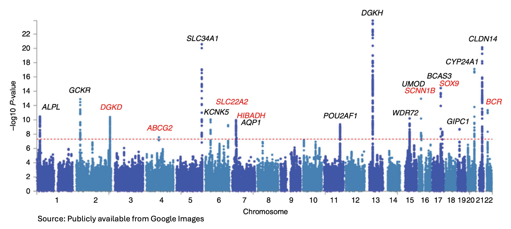
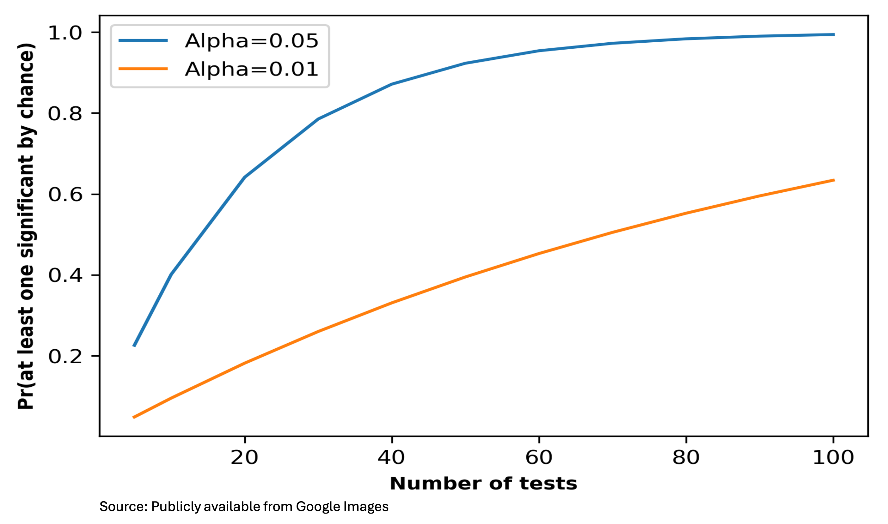
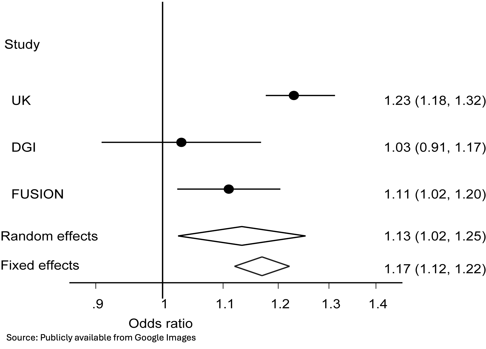

# Association testing II

```
$ echo "Data Sciences Institute"
```

----

# What You’ll Learn Today

- **Modeling association with population structure:** 
  - When and how to use linear mixed models to handle relatedness and population structure.
- **Discoveries at scale:** 
  - How to control error rates across millions of tests (Bonferroni genome-wide threshold, FDR). 
- **Combine evidence across studies:** 
  - GWAS meta-analysis (combine $p$-values or effect sizes; fixed vs. random effects) 
  - how to interpret heterogeneity.

-----

# Regression Approach

- Generalized linear models (GLMs)
$$
g(E(Y \mid X))=X \beta+C \alpha+\varepsilon,
$$
  - $g$ is the link function.
  - $X$ : the coded genotype
  - $C$ : covariates (age, gender, PCs )
  
- Test for genetic effect

$$
H_0: \beta=0
$$

- Can use likelihood ratio tests or score tests to test $H_0$
- Main advantage: it allows incorporation of covariates

----

# Mixed Effect models

- Handle population structure, family relatedness, and cryptic correlations
- Particularly useful when measurements are made on clusters or related individuals (family).
- Model phenotypes using a mixture of fixed effects (SNPs, covariates) and random effects (family structure).

-----
# Linear Mixed Models (LMM)
- Basic linear model: $Y=X \beta+C \alpha+\varepsilon$

- Mixed model extension: $Y=X \beta+C \alpha+u+\varepsilon$

  - $u$ : genetic random effects (heritability component)
  - $\varepsilon$ : residual, non-heritable variation
- Assumptions on random effects: $E(u)=0, \quad \operatorname{Var}(u)=\sigma_g^2 K.$

- Genetic covariance matrix: $K=\frac{G G^T}{M}$
  - $G: N \times M$ genotype matrix; $N$ : number of individuals; $M$ : number of SNPs.
- In GWAS, both $N$ and $M$ are very large $\rightarrow$ requires efficient methods
-----

# Linear Mixed Models (LMM)

- $K$ captures genetic relatedness, including population structure, family relationships, and hidden relatedness
- $\sigma_g^2$:genetic variance parameter we aim to estimate
- Estimation methods: REML (Restricted Maximum Likelihood) or AI-REML (Average Information REML)
- LMMs also allow us to estimate the individual random effects($\mu$)


-----

# Association testing in the LMM framework

Two-step fitting procedure for LMM:

- STEP 1: fit the null model.
$$
Y=C \alpha+u+\varepsilon
$$

  - We can regress out the effects of covariates:

$$
\tilde{Y}=u+\varepsilon
$$

  - $E(u)=0, \operatorname{Var}(u)=\sigma_g^2 K, \operatorname{Var}(\varepsilon)=\sigma_e^2 I$
  - Using REML/AI-REML we can estimate $\widehat{\sigma_g^2}$ and $\widehat{\sigma_e^2}$.
  - We can also get BLUP (best linear unbiased predictors)

$$
\widehat{u}=\widehat{\mathrm{K}} \widehat{\sigma_g^2} \times \Sigma^{-1}\left(\mathrm{I}-\mathrm{C}\left(C^T \Sigma^{-1} \mathrm{C}\right)^{-1} C^T \Sigma^{-1}\right) \mathrm{Y}, \Sigma=\widehat{\sigma_g^2} \mathrm{~K}+\widehat{\sigma_e^2} \mathrm{I}.
$$


----

# Association testing in the LMM framework

- STEP 2: test for association with each SNP $H_0: \beta=0$.

$$
\widehat{\boldsymbol{Y}}_{\text {resid }}^{\star}=\widetilde{\boldsymbol{Y}}-\widehat{u} .
$$

- Test for association in a linear (non-mixed) regression model

$$
\widehat{\boldsymbol{Y}}_{\text {resid }}^{\star}=X \beta+\varepsilon
$$

- STEP 1 is computationally demanding (large matrix operations like inversions), but it only needs to be done once under the null

- STEP 2 is then repeated for millions of SNPs

----


# Efficient LMM Methods for GWAS

- BOLT-LMM (Nature genetics, 2015)
  - Software: https://alkesgroup.broadinstitute.org/BOLT-LMM/BOLTLMMmanual.html
- fastGWA (Nature genetics, 2019) - assumes a sparse GRM
  - Software: https://yanglab.westlake.edu.cn/software/gcta/\#Overview
- SAIGE (Nature genetics, 2018)
  - Software: https://github.com/weizhouUMICH/SAIGE
- Regenie (Nature genetics, 2021)
  - Software: https://rgcgithub.github.io/regenie/


-----

# Heritability Estimation from GWAS

- Variance decomposition: $Var(Y) = Var(G) + Var(\varepsilon)$

- **Heritability:**$h^2 = \frac{Var(G)}{Var(Y)}$

- Earlier: used **trait covariance among relatives** (no genotypes)  
- Now: estimate heritability directly from **GWAS data**  
- Focus on **SNP heritability** → proportion of variance explained by common SNPs

---


# Heritability Estimation from GWAS

$$
Y=\mu+\sum_{m=1}^M a_m X_m+\epsilon
$$

- If causal variants (QTLs) were known, genetic variance could be computed as:  

$$
\sigma_g^2=\operatorname{Var}(G)=\sum_{m=1}^M \operatorname{Var}\left(a_m X_m\right)=\sum_{m=1}^M a_m^2 2 p_m\left(1-p_m\right) .
$$

- Problem: **causal variants are unknown**  
- Workaround: use significant SNPs as proxies for causal variants  
- Pitfalls: may include too few (if the selection is too strict) or too many (If the selection is too lenient).


----

# Heritability Estimation from GWAS

- $\operatorname{cov}\left(y_j, y_k\right)= \operatorname{cov}\left(\sum_{m=1}^M a_m X_{j m}, \sum_{m=1}^M a_m X_{k m}\right)=\sigma_g^2 K_{\text {causal }}[\mathrm{j}, \mathrm{k}]$
- $K_{\text {causal }}$: relatedness matrix from causal SNPs  
  - Cannot compute directly (causal SNPs unknown)  
- Instead, approximate with:  $K=G G^T / M$ based on all SNPs.
- Using REML/AI-REML to estimate $\widehat{\sigma_g^2}$
- $\quad h^2=\frac{\widehat{\sigma_g^2}}{\sigma_Y^2}$


-----

# Family-based Designs

- Family-based studies have a long tradition in genetics (association and linkage)  
- Example: compare the genotypes of affected individuals with their unaffected siblings  
- Using siblings as controls removes confounding from **population stratification**  

-----

# Family-based designs 

- Family-based designs are **robust to confounding** caused by population structure  
- Rejecting $H_0$ (no association) means more than simple correlation:  
  - The tested marker is likely **linked** to the true disease locus  
- In contrast, population-based designs may give false positives due to structure  
#### Question: why is this robustness lost in population-based studies?  
----

# Indirect association

- Genetic association studies typically test **markers**, not causal mutations  
- A marker may be correlated with the true causal variant → this is **indirect association**  
- **Linkage disequilibrium (LD)** (or correlation) between a marker and a causal locus (DSL) creates an apparent association with the phenotype 
- Key idea: the marker is not causal, but **tags the causal variant** through LD  

----

# The trio design and Transmission Disequilibrium Test (TDT)

- Setup: **affected offspring** and their **biological parents**  
- From parental genotypes, Mendel’s laws of segregation predict the expected offspring genotype distribution  
- **TDT test:** compares observed offspring genotypes with expectations from parental genotypes  
- Advantage: immune to bias from **population stratification**  
- If there is a genotype–phenotype association:  
  - Expect **over- or under-transmission** of certain alleles from parents to offspring  
----
<!--

# Application of Mendel’s first law
-->
# The trio design and Transmission Disequilibrium Test (TDT)

- Each parent has a transmitted allele and an untransmitted allele.
- w= \#homozygous AA parents and z=\#homozygous aa parents
- $w$ and $z$ are not informative
- x=\#heterozygous parents Aa that transmit A allele.
- $y=\#$ heterozygous parents Aa that transmit a allele.
- If no association, we have $\mathrm{E}[\mathrm{x}]=\mathrm{E}[\mathrm{y}]$.
- Hence, conditioning on $\mathrm{x}+\mathrm{y}$, the count x is $\operatorname{Bin}(\mathrm{x}+\mathrm{y}, 0.5)$.


----

# The trio design and Transmission Disequilibrium Test (TDT)

### Case-control design is more powerful but less robust than TDT

- Power of TDT is expected to be lower than for case - control design with the same number of cases because, e.g., homozygous parents do not contribute.
- Also, the trio design is more expensive: three genotypes compared to two in a case-control design.
- It can be difficult to obtain parental genotypes for late-onset diseases, e.g. Alzheimer's disease.
- Other family-based designs: discordant sibships, trios with multiple affected siblings, multi-generational pedigrees.

-----

# Family-based association test (FBAT)

- Originally, TDT limited to binary data and trio design
- Many extensions to handle other genetic models, missing data etc.
- FBAT is a unified family-based approach, an extension of TDT to:
- Missing parental genotypes, continuous phenotypes, time-to-onset, different genetic models.
- www.biostat.harvard.edu/~fbat/fbat.htm

----

# FBAT

- FBAT score statistic:

$$
\begin{aligned}
U & =\sum_{\substack{\text { family } i, \\
\text { offspring } j}} Y_{i j}\left(X_{i j}-E\left(X_{i j} \mid P_i\right)\right) \\
Z & =\frac{U}{\sqrt{\operatorname{Var}(U)}} \sim N(0,1)
\end{aligned}
$$

- The centering of the offspring genotype by its expected value conditional on parental genotypes helps maintain robustness to population stratification.
- If parental genotypes are missing one can use genotypes of other relatives for the conditioning above.


----


# Exercises

1. What is the alternative hypothesis for a TDT test (or any FBAT test), and how does that compare with the alternative of a test of association from a case-control or cohort study? Why is this important from a practical perspective?
2. The TDT is a conditional test. What are the random variables used in computing the null distribution of the test, and what variables are being conditioned on?


-----
## Complications when testing association with millions of markers in large GWAS studies

- So far, we have discussed one test/one genetic marker at a time.
- **Multiple testing in GWAS** - millions of tests at once
- **Meta-analysis of multiple datasets** - combine data/results from multiple studies


----

# Multiple Testing 


-----

# GWAS of Kidney Stone Disease

- In a typical GWAS we perform millions of tests. How do we account for that?  What Significance level should we use?
   

----

# Multiple Testing

- Multiple testing issues arise when many markers are tested as in GWAS.
- Major statistical problem as it leads to loss of power, and increased false positive rates if not accounted for.
- Idea: Test each marker separately and adjust the significance level of each test.


----

# Why do we need to adjust for multiple testing?

 
  
----

# Methods based on P-value Adjustment

- Test each SNP separately and adjust the significance level of each test in order to preserve the overall error rate.
- Two different error rates:
  1. Family-wise error rate (FWER)
  2. False discovery rate (FDR)

- If $M$ is the total number of tested SNPs, then for each $m=1, \ldots, M$, we define the null hypothesis:
$H_0(m)$ : no association between the $m$-th SNP and the phenotype.


----

# Bonferroni method

- **FWER (family-wise error rate)** or experiment-wise error rate:
$$
F W E R=P\left(\text { reject at least one } H_0(m) \mid H_0(m) \text { is true for all } m\right)
$$
<br>

- **Bonferroni**: fix $F W E R=\alpha$ and set individual significance levels at $\frac{\alpha}{M}$.
- This ensures that the FWER is less than the desired level $\alpha$ (e.g. 0.05).
- If markers are not independent (due to linkage disequilibrium) the Bonferroni adjustment is conservative.
- E.g. extreme case: only one independent marker among $M$ and the true FWER is $\frac{\alpha}{M}$.

-----

# Bonferroni threshold for GWAS

- The effective number of independent tests in a dense GWAS study is 1 million, so the Bonferroni adjustment corresponds to a significance level of $5 \times 10^{-8}$.
- This corresponds to a finding by chance 1 in 20 GWAS studies.
- Large sample sizes are needed for such a stringent threshold.

-----

# False Discovery Rate (FDR)

- Rather than control the Type-1 error, FDR limits the expected number of null-hypotheses that are rejected incorrectly.
- FDR=5\% means that on average 5\% of the SNPs we rejected are in fact false positives.
- FDR is less conservative than FWER $\rightarrow$ higher power.
- FDR is less accepted in the GWAS setting, but useful for GWAS where results are followed up.


-----

# False Discovery Rate (FDR)

|  | Declared non- <br> significant | Declared <br> significant |  |
| :--- | :--- | :--- | :--- |
| True null <br> hypotheses | $U$ | $V$ | $M_{0}$ |
| False null <br> hypotheses | $T$ | $S$ | $M-M_{0}$ |
|  | $M-R$ | $R$ | $M$ |

- Assume there are $M$ independent markers.
- The false discovery rate is $\mathrm{E}\left(\frac{V}{R}\right)$ (expectation of false discovery proportion).
- Goal: keep the FDR below a specific threshold, e.g. 0.05 or 0.10.

------

# Benjamini–Hochberg (BH) procedure

- Benjamini and Hochberg (1995) procedure can be used to control the FDR.
- Rank the $M$ p-values from smallest to largest:

$$
p_{(1)}, \ldots, p_{(M)}
$$

- For a specified FDR level (e.g. 0.05), compare

$$
p_{(i)} \leq \frac{i}{m} F D R
$$

- Find largest $i$ for which this inequality holds, and then reject tests that correspond to $1, \ldots, i$.
- For dependent tests, extensions are available (e.g. Benjamini-Yekutieli 2001).

-----


# Example

<small>

| $i$ | 1 | 2 | 3 | 4 | 5 | 6 | 7 | 8 | 9 | 10 |
| :---: | :--- | :--- | :--- | :--- | :--- | :--- | :--- | :--- | :--- | :--- |
| $p_{(i)}$ | 0.002 | 0.005 | 0.006 | 0.008 | 0.009 | 0.009 | 0.017 | 0.025 | 0.105 | 0.54 |
| $10 \frac{p_{(i)}}{i}$ | 0.02 | 0.022 | 0.02 | 0.02 | 0.017 | 0.015 | 0.025 | 0.031 | 0.11 | 0.54|

</small>
FDR = 5% reject hypotheses 1-8 –> more than Bonferroni that rejects only two.


-----

# Meta-analysis


----

# Meta-analysis

- Meta-analysis is essential in GWAS.
- GWAS studies are extremely large $\rightarrow$ require combining many smaller cohorts.
  - Example: the largest GWAS on height (2022) analyzed 5.4 million individuals across diverse ancestries and identified 12,111 independent SNPs.
- Purpose: to combine information from multiple independent studies.

-----

# Meta-analysis

- Combines information from multiple independent studies.
- Increases statistical power by boosting sample size.
- Helps assess consistency of findings across datasets.
- Methods:
  - Combine $p$-values or Z-scores (e.g., Fisher's method).
  - Combine effect sizes.

----

# Combine p-values or Z-scores

- Combine p -values $p_{m k}$ for variant $m$ and stage $k$ using **Fisher's method**:

$$
X_{2 K}^2=-2 \sum_{k=1}^K \ln \left(p_{m k}\right) \sim \chi_{2 K}^2.
$$

- This approach does not take into account sample size differences between studies.
- We would like to give more weight to the larger studies, we can combine Z-scores:

$$
Z_m=\left(\frac{1}{\sqrt{\sum_k n_k}} \sum_k \sqrt{n_k} Z_{m k}\right) \sim N(0,1).
$$

-----

# Fixed-effects meta-analysis

- Constant effect size across studies.
- Observed effect size in each study varies due to random sampling error.
- **Combined effect estimates the fixed effect size (the same underlying parameter across studies)**.
- Might be realistic if, for example, the studies have all been conducted in the same population, consistently measured phenotypes, same inclusion criteria etc.
- In practice, that may not be true.

----

# Random-effects meta analysis

Random-effects meta-analysis.
- True effect size may vary from study to study (so there is a study-specific true effect).
- Observed effect size in each study varies due to both random error and differences in true effect sizes across studies.
- **Combined effect estimates the mean of the distribution of true effects**.


-----

# Fixed-effect model

- We assume we have $K$ studies.
- Let $\hat{\beta}_1, \ldots, \hat{\beta}_K$ be the effect-size estimates (e.g. $\log (O R)$ or regression coefficients).
- Let $\hat{\sigma}_i=S E\left(\hat{\beta}_i\right)^2$ (within study variance) and $w_i=\hat{\sigma}_i{ }^{-1}$.
- The overall inverse-variance-weighted effect-size is:

$$
\hat{\beta}=\frac{\sum_{i=1}^K w_i \widehat{\beta}_i}{\sum_{i=1}^K w_i}.
$$

----

# Fixed-effect model

- $\hat{\beta}$ follows a normal distribution, with $\operatorname{SE}(\hat{\beta})=1 / \sqrt{\sum_{i=1}^K w_i}$.

$$
\hat{\beta}^{\sim} \mathrm{N}\left(\beta,\left(\sum_{i=1}^K w_i\right)^{-1}\right)
$$

- Larger studies are given higher weight compared with smaller studies. So if one very large study and other small studies, the large study will dominate.


-----

# Random-effect model

- In the RE model, we assume that the true effects $\beta_i=\beta+ \xi_i, \xi_i \sim N\left(0, \tau^2\right)$.
- The overall effect-size is estimated as:

$$
\hat{\beta}=\frac{\sum_{i=1}^K w_i^* \hat{\beta}_i}{\sum_{i=1}^K w_i^*}
$$

- $w_i^*=\left(\hat{\sigma}_i+\hat{\tau}^2\right)^{-1}$.
- The weight here depends both on the within study variance and also on the between-study heterogeneity in true effects.
- $$
  \hat{\beta} \sim \mathrm{N}\left(\beta,\left(\sum_{i=1}^K w_i^*\right)^{-1}\right).$$


----

# Random-effect model

- $w_i^*=\left(\hat{\sigma}_i+\hat{\tau}^2\right)^{-1}\left(\right.$ in fixed effect $\left.w_i=\hat{\sigma}_i{ }^{-1}\right)$
- Smaller studies are given relatively more weight than in the fixed effect model
- The calculated standard error is smaller from a fixed effects meta-analysis than that from a random-effects meta-analysis.
- How to estimate the between-study variance $\hat{\tau}^2$ ?
- Many different methods, e.g. DerSimonian and Laird (DL)


-----

# Fixed vs. Random Effect model

- The decision needs to be done before the analysis based on knowledge about the individual studies
- **Fixed effect meta-analysis is typically used in genetics**, without regard to heterogeneity.
- Random effect meta-analysis is typically too conservative (less powerful).


----

### Meta-analysis of three GWAS studies assessing the link between the FTO rs8050136 variant and type 2 diabetes

 

-----

# What's Next

- Population Stratification
- Genotype Imputation
- Quality Control

## What questions do you have about anything from today?


<!--

Exercises

Chapter 9 Exercise 1.
Chapter 9 Exercise 2.
Chapter 9 Exercise 3.
Chapter 9 Exercise 4.
Chapter 9 Exercise 5.
--->


