# Population Stratification & Genotype Imputation 

```
$ echo "Data Sciences Institute"
```

----

# What You’ll Learn Today

- **Why population structure matters:** Recognize how stratification and relatedness inflate association signals, learn core fixes (genomic control, PCA covariates, mixed models) as well as common pitfalls.
- **Use PCs and LMMs effectively:** Apply principal components for visualization/adjustment and deploy linear mixed models to obtain calibrated tests at scale.
- **Genotype imputation in practice:** Understand the reference-panel, LD-driven inference, quality metrics (e.g., INFO/$r^2$), and common pitfalls.

-----

# Population Stratification

- Different subgroups present within your population.

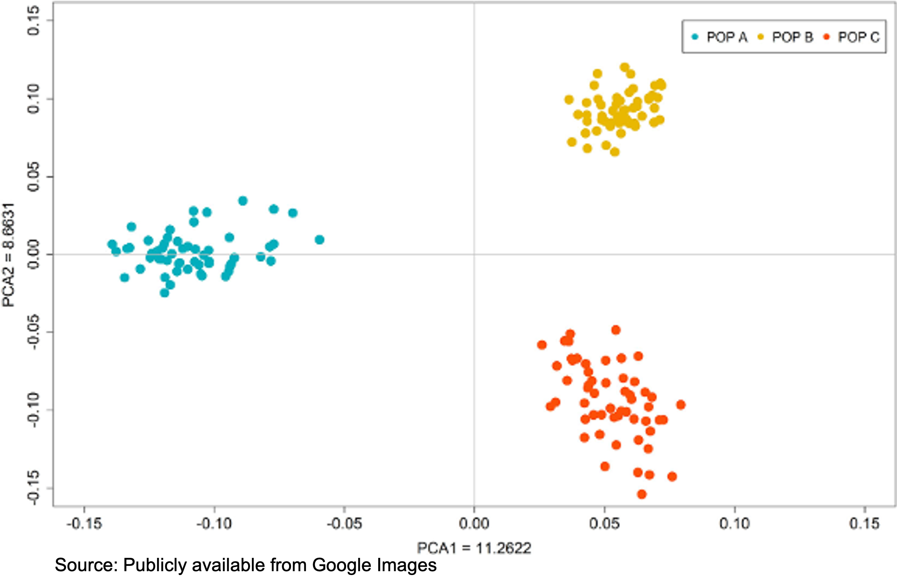 

-----

# Population Stratification

- Population structure leads to differences in both traits and allele frequencies across regions.

  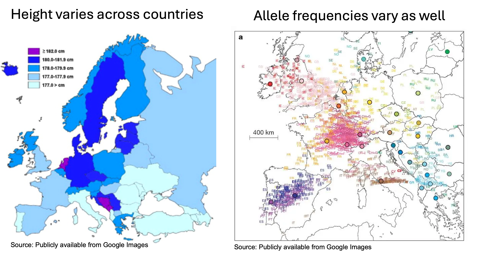

----


# Population Structure Acts as a Confounder

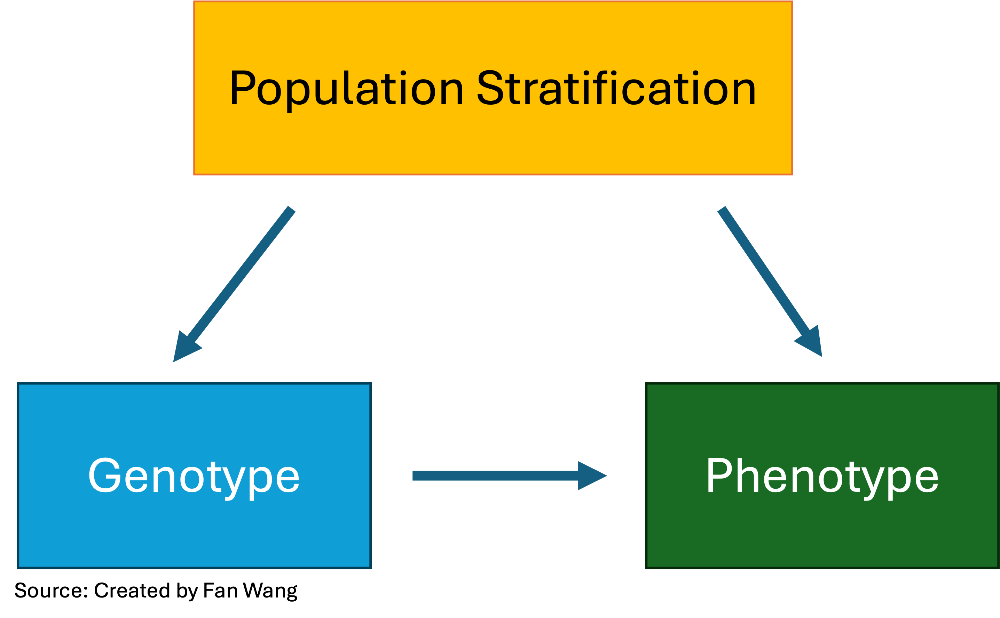 

- Failing to account for population stratification results in incorrect variance estimates for the association test statistic $\rightarrow$ **false positive associations**.

-----

# How to Address Population Stratification?

1.  **Hardy-Weinberg failure**
    -   Not powerful, provides no adjustment.
2.  **Modern approaches**
    -   Use large sets of *null markers*.
    -   Stratification causes global inflation of test statistics at
        null markers (not disease-associated).
    -   By examining these markers, we can estimate the extent of
        stratification.
    -   Enabled by GWAS: millions of markers available, most are null.

----

# Approaches to Adjust for Population Stratification

- Genomic Control
- Clustering approaches
- Principal component analysis (PCA)
- Mixed effect models


-----

# Genomic Control (GC)

- WE define GC lambda as
$$
\lambda=\frac{\operatorname{median}\left(\chi_1^2, \ldots, \chi_L^2\right)}{0.4549}
$$

  - If $\lambda>1.05 \rightarrow$ population stratification likely
  - Corrected test statistic:

$$
\chi_{l, G C}^2=\frac{\chi_l^2}{\lambda}, \quad \forall l=1, \ldots, L.
$$

-----

# Key Principles of Genomic Control

- Most SNPs are expected not associated with the trait.
- If many SNPs show inflated test statistics $\rightarrow$ evidence of stratification.
- Compare **observed median $\mathbf{X}^2$** to 0.4549 (expected under the null).
- Ratio measures inflation due to stratification.
- Stratification should affect all loci equally $\rightarrow$ similar inflation across SNPs.
- Adjust each statistic by rescaling with GC $\lambda$.
<br>

- Genomic control uses **a constant adjustment factor for all SNPs**.
- Can lead to overadjustment at some SNPs and underadjustment at other SNPs.

------

# STRUCTURE 

- Bayesian clustering model (Pritchard, Stephens, Donnelly, Genetics 2000) **infer the latent population structure** by a stratified analysis.
- Assigns individuals to $K$ source populations; under admixture, each individual can have **fractional ancestry** across populations.
- Works best with **strong population structure** (a few distinct ancestries) and **many variants / ancestry-informative markers (AIMs)**.

- A practical issue is choosing $K$ in advance.

  - Larger $K$ can overfit, so model-selection/diagnostic procedures are needed.

  - Often used exploratorily by comparing results across several values of $K$.

-----

# STRUCTURE

##### Convergence of Structure: Taita thrush data (K=3).
    
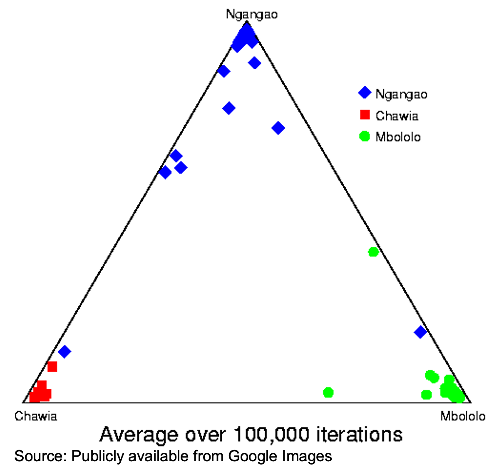 

- The ternary plot shows each individual’s proportional ancestry.

- Points near a vertex indicate near-pure membership in one cluster; interior points indicate admixture.


-----

# STRUCTURE Bar Plots

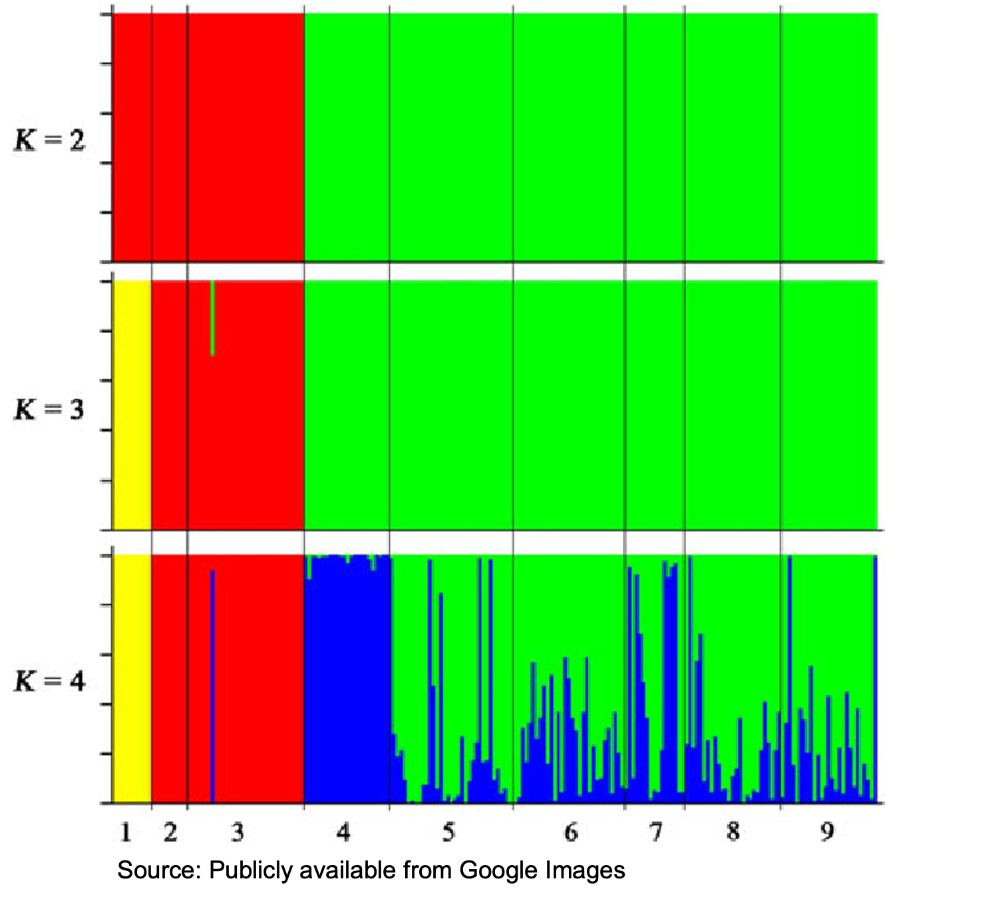 

- Each vertical bar = one individual; the color fractions are the estimated membership coefficients.
- Individuals with same color patterns are inferred to belong to the same cluster.

----

# Applying STRUCTURE to Admixed Populations

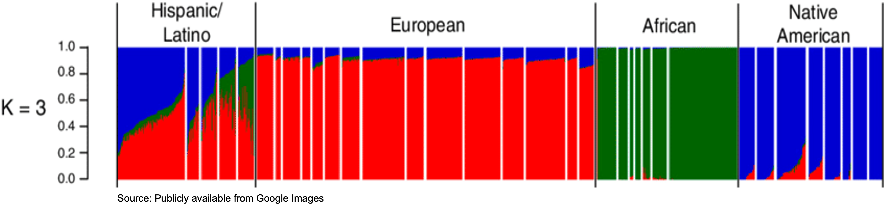


-----

# Principal Component Analysis 
(**Eigenstrat**, Nature Genetics 2006)

- Widely used approach to control for population structure in genetic association studies.
- Intuition: ancestry/geography leaves correlated patterns in genotypes that can be summarized by a few axes.
- Start with a genotype matrix $X \in \mathbb{R}^{n \times m}$ ( $n$ individuals, $m$ SNPs); aim for a low-dimensional summary with $k \ll m$.

----

# What PCA Does

- Principal component analysis (PCA) is a statistical procedure that allows us to perform **dimension reduction**.
  - Finds orthogonal directions (“principal components”) that capture the **largest possible variance** in the data.
  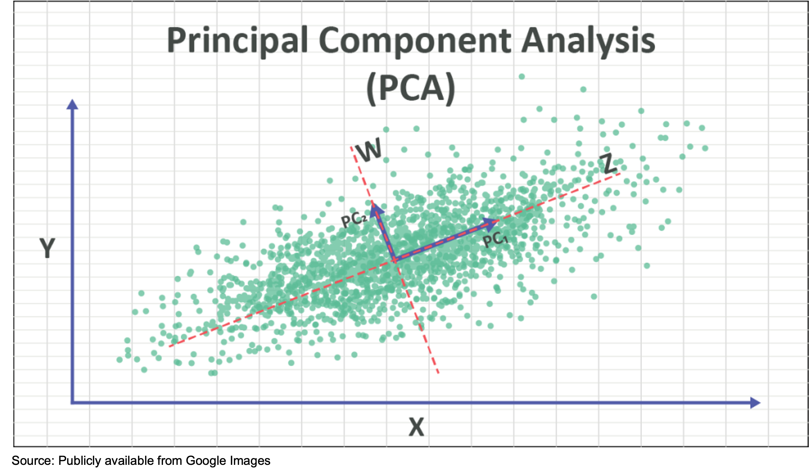
----


# Geometric Picture

- Identify a pair of orthogonal vectors (red) that define a lower-dimensional plane (gray) and **maximize the variance of the projection**.
  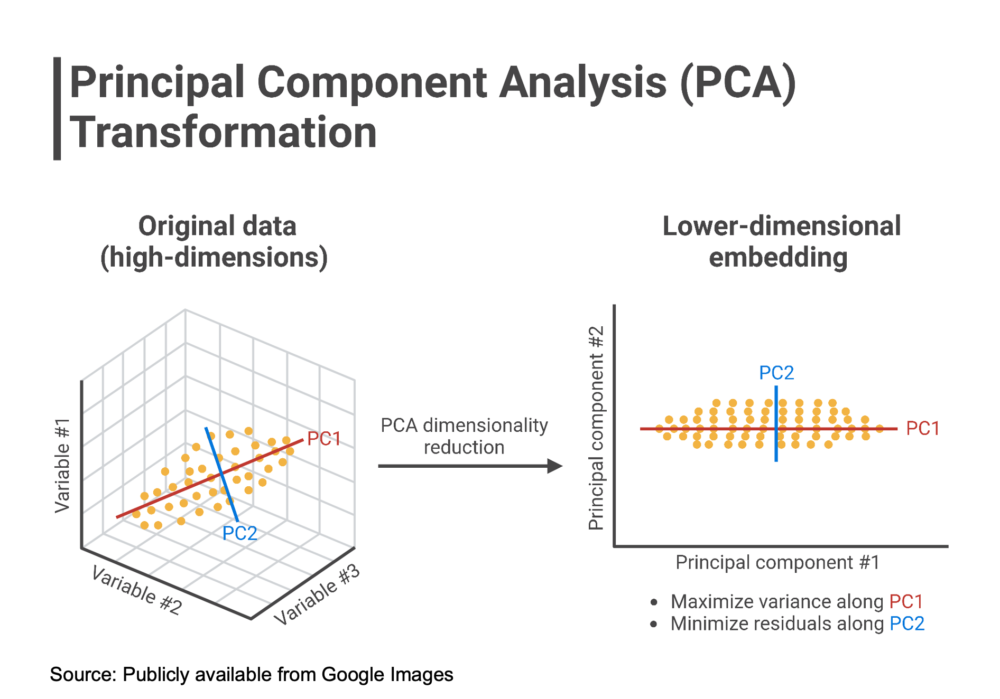

----

# Formal Objective

- Given $X=\left[x_1, \ldots, x_n\right]^{\top}$, find a $k$-dimensional subspace minimizing the mean squared reconstruction error (equivalently, maximizing captured variance).
- Two equivalent views:
  - Maximize variance along chosen directions.
  - Minimize residuals from projecting onto the subspace.
  
    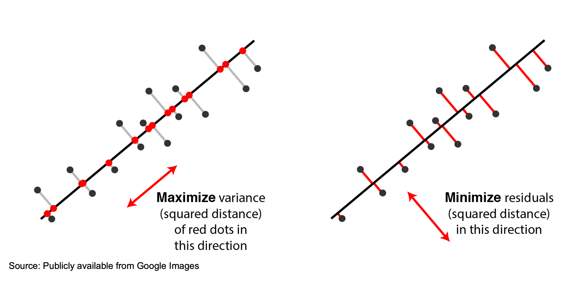

------

# Optimization Formulation

$$
\min _{W, C}\left\|X-W C^{\top}\right\|_F \quad \text { s.t. } C^{\top} C=I_k
$$

- Shapes: $W \in \mathbb{R}^{n \times k}$ (scores), $C \in \mathbb{R}^{m \times k}$ (loadings).
- Many solvers exist; a standard route is via **eigendecomposition/SVD** of a covariance matrix.

------

# Practical Algorithm

1. Center the data (i.e., each SNP): column means of $X$ are set to zero.
2. Compute the covariance matrix of the data: $S=X^{\top} X$.
3. Take the top $k$ eigenvectors of the covariance matrix that have the largest eigenvalues $\rightarrow$ the top $k$ principal component.
4. Low-rank reconstruction: $X \approx W C^{\top}$.

-----

# Lower-Dimensional Representation

  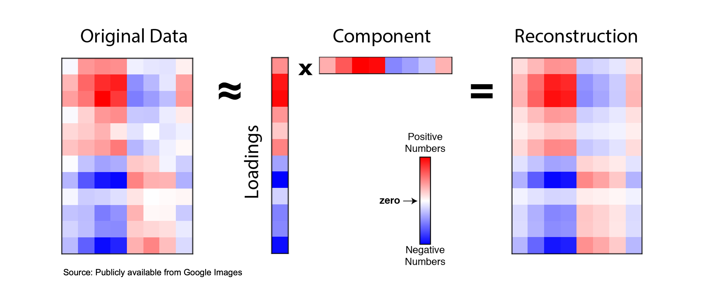
  
------

# How Many PCs?

- Goal: use the fewest PCs that retain the relevant structure while avoiding noise/overfit.
- For data visualization, only a few are needed.
- To adjustment for stratification, the right number is data-dependent.
- Inspect explained variance / scree plot and add PCs until major structure is captured.
  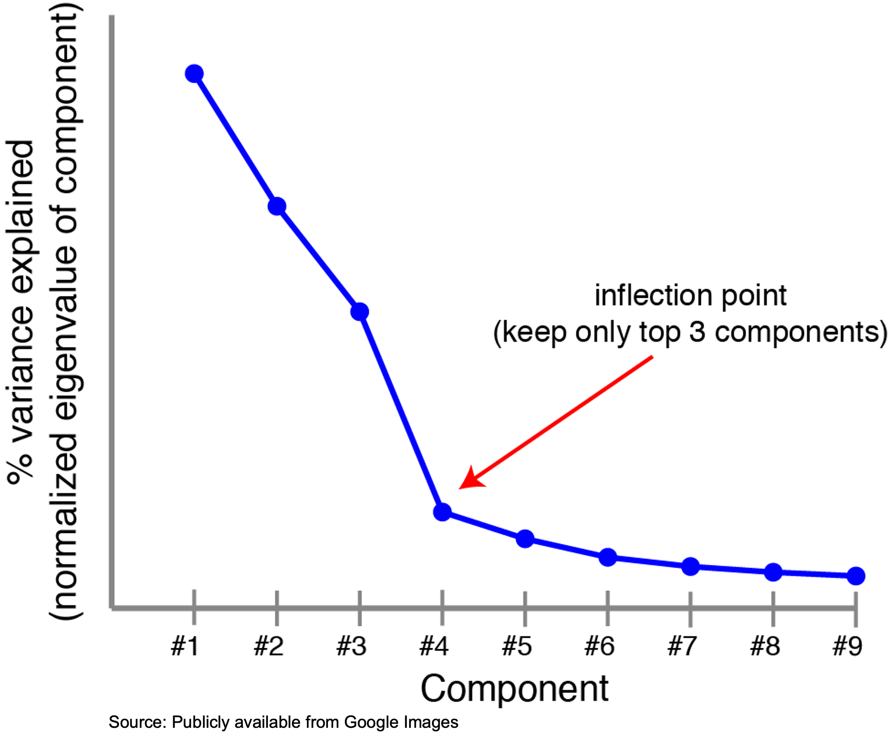

-----

# How can we use PCA?

- Data Visualization: Project samples onto the leading PCs (e.g., PC1–PC2) and plot them to reveal clusters and gradients.

- Adjustment for confounding: Include the top PCs as covariates to control for population stratification in association analyses.

- 1000 Genomes PCA example: http://bwlewis.github.io/1000_genomes_examples/PCA_overview.html

-----

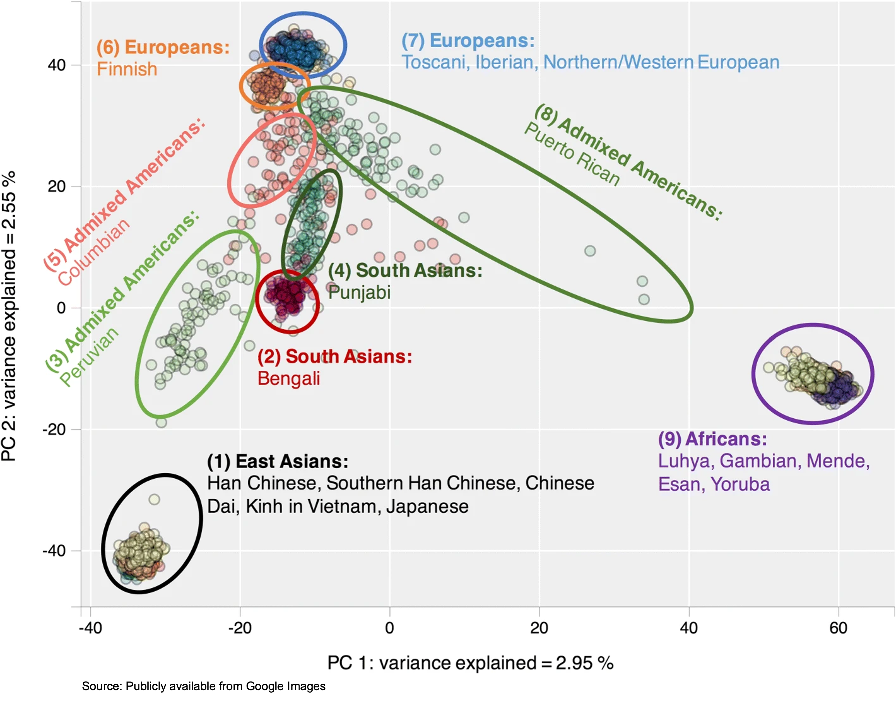


------

# Correcting Stratification with Principal Components

- PC adjustment reduces inflation.

- Diminishing returns: Most correction occurs by ~10–20 PCs (or significant PCs).

- Trait-specific effect: Height shows the strongest inflation and benefits most from PC adjustment.

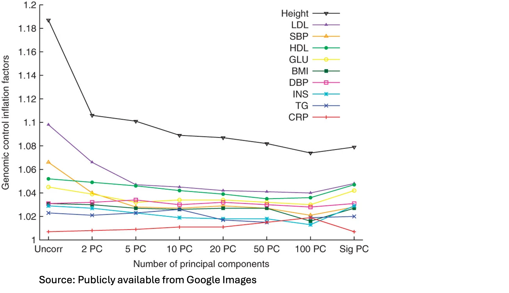


-------

# Mixed Effect Models

- Mixed effect models can model population structure, family structure and cryptic relatedness.
- Model phenotypes using a mixture of fixed effects (SNPs) and random effects (family structure).
- An early approach EMMAX (Nature Genetics, 2010) is based on the mixed-effects model to account for hidden relatedness.
- Many other methods (BOLT-LMM, fastGWAS, SAIGE, REGENIE) have been proposed to improve the computational efficiency of these methods.

----

# Linear Mixed Models (LMM) - Review
- **Ordinary linear model**:$Y=X \beta+C \alpha+\varepsilon$

- **Mixed linear model**:$Y=X \beta+C \alpha+u+\varepsilon$
  - $u$ : genetic (heritable) random effect. $E(u)=0, \operatorname{Var}(u)=\sigma_g^2 K$.
  - $\varepsilon$ : residual, non-genetic noise. $\operatorname{Var}(\varepsilon)=\sigma_e^2 I$.
- **Genetic relationship matrix (GRM):** $K = \frac{G G^T}{M}$,
  where $G=$ genotype matrix ( $N \times M$ ), $N=$ \#individuals, $M=$\# SNPs (both large in GWAS).

------

# Linear Mixed effect Models (LMM) - Review


- $K$ captures all kinds of relatedness:population stratification, family structure and hidden/cryptic relatedness.
- $\sigma_g^2$ : genetic variance that we want to estimate.
  - Estimation methods: REML or AI-REML.
- From the model, we can also derive estimates of random effects $(u)$.

-------

# Association Testing with LMM (Step 1)

**Step 1: Fit the null model**

$$
Y=C \alpha+u+\varepsilon
$$

- Remove covariate effects:

$$
\tilde{Y}=u+\varepsilon
$$

- Using REML/AI-REML we estimate $\sigma_g^2$ and $\sigma_e^2$.
- Can also obtain **BLUPs** (best linear unbiased predictors) of $u$:
$$
\hat{u}=\mathrm{K} \widehat{\sigma_g^2} \times \Sigma^{-1}\left(\mathrm{I}-\mathrm{C}\left(C^T \Sigma^{-1} \mathrm{C}\right)^{-1} C^T \Sigma^{-1}\right) \mathrm{Y}
$$

  - $\Sigma=\widehat{\sigma_g^2} \mathrm{~K}+\widehat{\sigma_e^2} \mathrm{I}$.


------

# Association Testing with LMM (Step 2)

**Step 2: Test SNP effects**
- Hypothesis: $H_0$ : $\beta=0$
- Residual phenotype after removing random effect:

$$
Y_{\text {resid }}^*=\tilde{Y}-\hat{u}
$$

- Fit a standard linear regression:

$$
Y_{\text {resid }}^*=X \beta+\varepsilon
$$

- **Computational aspects**:
- Step 1 is expensive (matrix inversions, large-scale operations) but done only once.
- Step 2 is repeated across millions of SNPs (efficient).


--------

# PCA VS. Mixed Model


  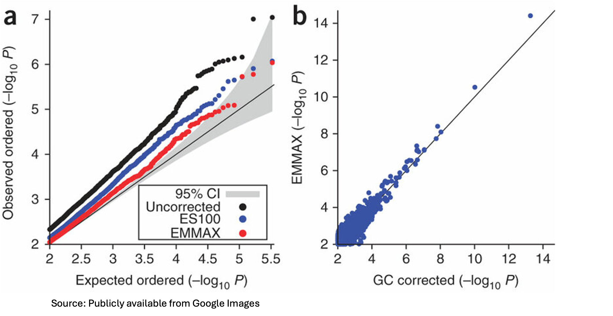 

<!-- 
- Population structure causes inflated associations if uncorrected.

- PCA helps, but is not perfect (especially in large datasets or with subtle relatedness).

- Linear mixed models (EMMAX) provide the most robust correction for height, keeping the distribution close to null while retaining power for true associations.
-->
------

# Q–Q plot as a Diagnostic Tool

- Order SNPs according to their p-values.

- Compare the distribution of observed vs. expected test statistics or p-values under the null hypothesis.

- Deviations from the diagonal line indicate potential population stratification or true associations.
   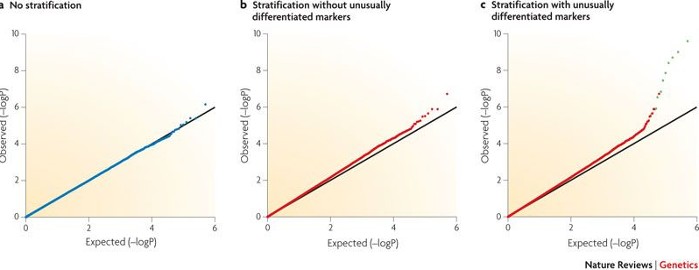 

------

# Is population stratification fully resolved?

- The answer is no — existing correction methods may fail or be insufficient in some scenarios.

- Good epidemiological study design is still the most important way to avoid confounding.

- Relying on convenience controls can introduce substantial bias.

- Family-based designs are gaining renewed interest due to their robustness to population stratification.

-------

# Genotype Imputation

- Missing data in genotypes can arise in two ways:
   - The genotype matrix contains missing values, similar to classical missing data.
   - Genotyping arrays only assay a subset of SNPs, leaving many unmeasured.
     - E.g. A genotyping platform may capture ~500K SNPs, while tens of millions of common SNPs exist across the genome. For association studies, we are often interested in testing many more of these. 

- Question: **Can we statistically recover (“impute”) these untyped SNPs?**


-----

# Genotype Imputation
Genotype data with missing data at untyped SNPs (grey question marks)

| 1 | ? | 1 | ? | 1 | ? | 0 | 2 | 2 | ? | 2 | ? | 0 |
| :--- | :--- | :--- | :--- | :--- | :--- | :--- | :--- | :--- | :--- | :--- | :--- | :--- |
| 0 | ? | 2 | ? | 2 | ? | 0 | 2 | 2 | ? | 2 | ? | 0 |
| 1 | ? | 2 | ? | 2 | ? | 0 | 2 | 1 | ? | 2 | ? | 0 |
| 1 | ? | 2 | ? | 1 | ? | 1 | 2 | 2 | ? | 2 | ? | 0 |
| 2 | ? | 2 | ? | 2 | ? | 1 | 2 | 1 | ? | 2 | ? | 0 |
| 1 | ? | 1 | ? | 1 | ? | 1 | 2 | 2 | ? | 2 | ? | 0 |
| 1 | ? | 2 | ? | 2 | ? | 0 | 2 | 1 | ? | 2 | ? | 1 |

------

# UK Biobank Imputation

- UK Biobank released data on $\sim 500,000$ individuals, including genotypes and thousands of phenotypes.
- Each sample was initially genotyped with $<1$ million SNPs.
- Using haplotype reference panels, imputation expanded this to $\sim 80$ million variants.
- The resulting dataset is massive: $\sim 2$ TB of imputed genetic information.

----

# Leveraging LD for Imputation

- Correlations among SNPs, known as linkage disequilibrium (LD), allow us to infer untyped variants from observed ones.
  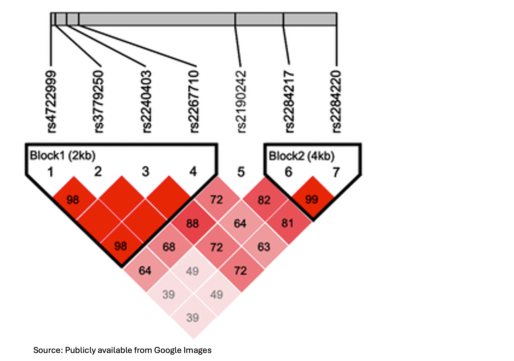 

-----

# Principles of Imputation

- Imputation methods infer genotypes at untyped sites using patterns from reference panels.
- Often described as **in-silico genotyping.**
- Widely applied in GWAS for:
   - Increasing statistical power.
   - Enabling meta-analysis by harmonizing across studies.

-----

# Reference Panels

- In GWAS, we typically start with ~500K genotyped SNPs.
- To impute additional SNPs, we require a **reference dataset** containing observed genotypes at those untyped sites.
- Examples of reference resources: HapMap, 1000 Genomes, UK Biobank, TOPMed.
- **Haplotypes:** each individual genotype can be decomposed into two haplotypes, inherited from each parent.


-----

# Matching Haplotypes

- The reference panel must be sufficiently large and diverse to include a comprehensive set of haplotypes, enabling reconstruction of any individual in the population.
  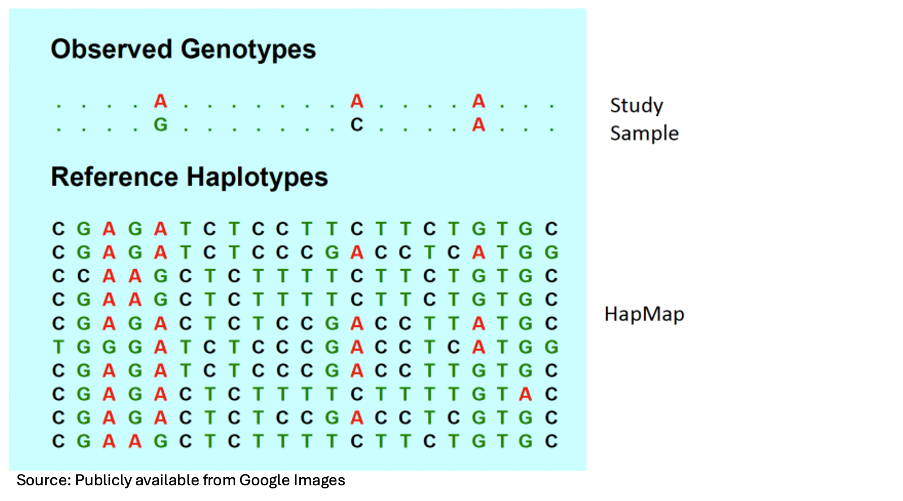 

-----

# Inferring Missing Genotypes

- Once suitable haplotypes are identified, missing alleles can be filled in.
- The imputed genotype data is a probabilistic reconstruction, guided by LD and haplotype structure.
   

-----

# Imputation Workflow

  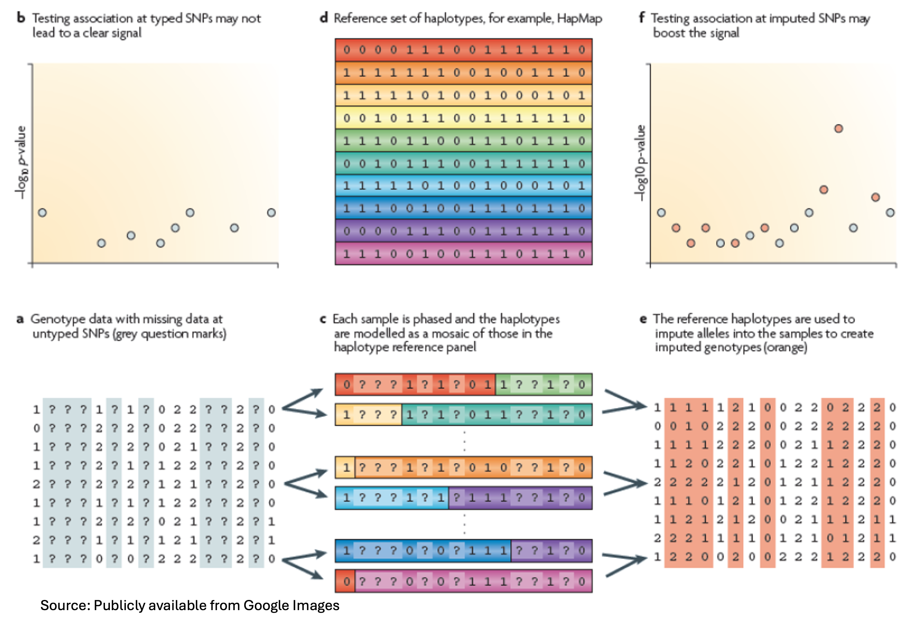


------

# How Imputation Works

- Starting point: a reference set of haplotypes.
- Using the linkage disequilibrium (LD) structure in a reference population, together with the LD among observed SNPs in a dataset, we can impute the alleles of an untyped (hidden) SNP.
- Critical assumption: reference samples and study participants come from the same (or very similar) population.
- If mismatched, imputation accuracy declines significantly.


-----

# Reference Panel Resources and Limitations
- 1000 Genomes Project: ~7.7M SNPs.
- Haplotype Reference Consortium (HRC): 64,976 haplotypes, $>39$ M SNPs (minor allele count $\geq 5$ ).
- TOPMed Reference Panel: ~97K deeply sequenced genomes, >300M variants.
- Imputation accuracy depends on:
  - Reference panel size. Small panels can overfit and yield unstable imputations.
  - Population match. The study cohort should resemble the reference.
- Whole-genome sequencing (WGS) data with large sample sizes are very useful as reference datasets for imputation, especially for low-frequency variants.

-----

# Imputation Model

- Think of an individual's genotype as a mosaic of two haplotypes drawn from a reference set - this is what enables imputation.
- Let $H$ be the reference haplotypes and $G_i$ the genotype vector for individual $i$.
- Model the likelihood by summing over latent haplotype pairs $Z$ :

$$
P\left(G_i \mid H, \theta, \rho\right)=\sum_Z P\left(G_i \mid Z, \theta\right) P(Z \mid H, \rho)
$$

- Each $Z$ is a pair of haplotype sequences assembled from the reference, allowing for recombination ( $\rho$ ).
- Include a small mutation rate $(\theta)$ so $Z$ can generate $G$.

----

# Imputation Model

- Goal: given $\theta, \rho$, and $H$, evaluate $P\left(G_i \mid H, \theta, \rho\right)$ for each individual.
- This is computationally heavy and is typically implemented with Hidden Markov Models (HMMs).
- Common software: IMPUTE, MACH, BEAGLE.
- The Michigan Imputation Server: https://imputationserver.sph.umich.edu/index.html.

----

# Minor Allele Frequency (MAF) Effect

- Common SNPs are imputed more accurately than rare SNPs.
  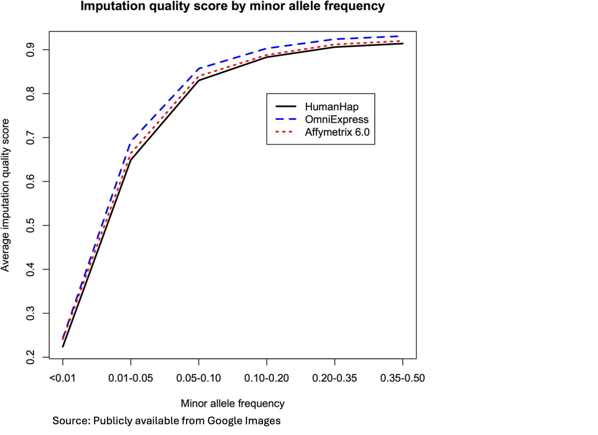
-----

# Using Imputed Genotypes

- Accuracy matters $\rightarrow$ **Poor imputation** can create **false positives**.
- SNPs flagged as associated are often **regenotyped*** for confirmation.
- Imputation yields probabilities for the three genotypes; use them in downstream association analyses.
  - For each SNP and each individual: $P(A A), P(A a), P(a a).$

-----

# Example


  | SNP | $p_0$ | $p_1$ | $p_2$ | AF1 |
  | :--- | :--- | :--- | :--- | :--- |
  | 1 | 0.85 | 0.14 | 0.01 | 0.35 |
  | 2 | 0.01 | 0.98 | 0.01 | 0.44 |
  | 3 | 0.96 | 0.039 | 0.001 | 0.02 |
  | 4 | 0.87 | 0.11 | 0.02 | 0.04 |

- In the example, SNPs shows high confidence in the imputed genotype.

----

# Choices for Association Analyses

1. **Multiple imputations** (draws from genotype posteriors).
2. **Best-guess genotype**: $\arg \max \{P(A A), P(A a), P(a a)\}$.
3. **Expected allele count (dosage)**: $E$ [alleles] $=2 P(A A)+P(A a)$.

- Quality metric: $r^2$ between best-guess genotype (or true genotype when masked) and the expected allele count.

- Validation approach: hide some SNP genotypes, run imputation, and compare the predictions to the masked truth.

- Filter low-quality sites, e.g., exclude SNPs with $r^2<0.9$ (threshold can vary by study).

-----

# Information Measure After Imputation

- How much information did imputation add for SNP $l$ ?

$$
\mathrm{INFO}_l=1-\frac{1}{n} \sum_{i=1}^n \frac{v_{i l}}{w_l}
$$

where $v_{i l}=\mathbb{E}\left(x_{i l}^2 \mid p_i\right)-\left[\mathbb{E}\left(x_{i l} \mid p_i\right)\right]^2$ is the variance of the imputed genotype for person $i$, and $w_l=2 f_l\left(1-f_l\right)$ is the expected variance under HWE (allele frequency $f_l$).
- Interpretation:
  - INFO = 1: complete certainty in imputation (one of the p's is 1).
  - INFO = 0: no gain beyond what we could have imputed using only allele frequency.


-------

# Imputation Portals 

- Michigan Imputation Server: https://imputationserver.sph.umich.edu/index.html#!:
  - upload GWAS genotypes (VCF/PLINK), select a reference panel, receive phased + imputed data.
- TOPMed Imputation Server: https://imputation.biodatacatalyst.nhlbi.nih.gov/#!
 


-------

# Imputation Portals 

  
  
--------

# Application

- Imputed vs. array SNPs: Imputation adds dense coverage across the region, beyond the 500k array.
- Stronger signal: The top association reaches $P \approx 1 \times 10^{-8}$, clearer than with typed SNPs alone.
  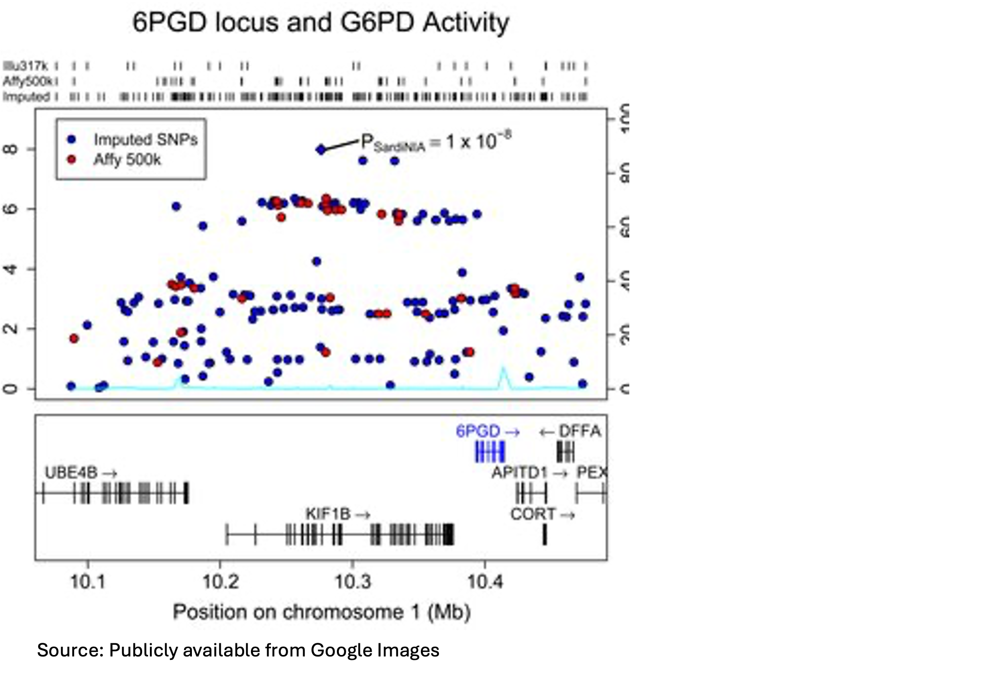


----------

# Application 

- Imputed variants densely tile the region and highlight signals missed by the 60k typed set.
- Imputed dosages separate well by true genotypes (AA/AC/CC), indicating high accuracy.
 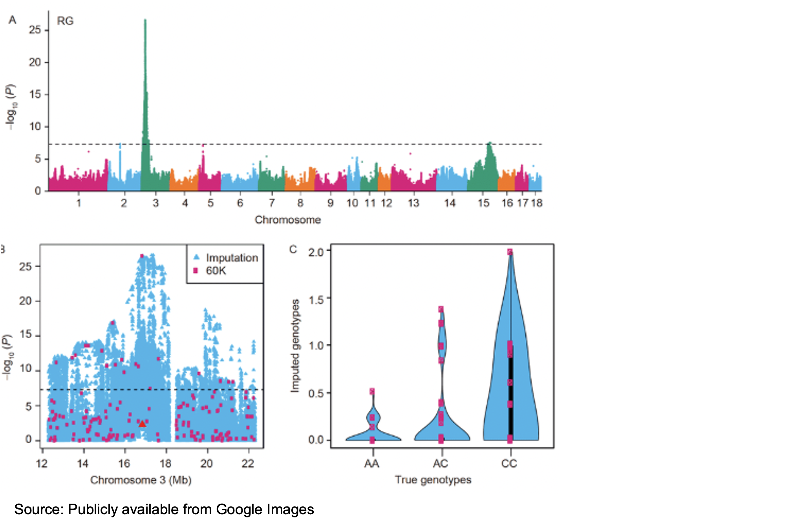


----------

# Take-Home Point

- Imputation reliably recovers common variants because they sit on long-range linkage disequilibrium (LD) patterns that are well represented in current reference panels. 

- For low-frequency and rare alleles, accuracy drops sharply as MAF decreases-posterior dosage $r^2$ / INFO deteriorates
   - Such alleles are sparsely observed, have weaker LD tags, and are often population-specific.
   
- Extending the same reliability to rare variants requires larger, ancestry-representative WGS panels, improved phasing, and ancestry-aware algorithms, with stringent quality control and experimental confirmation of key findings.

------

# What's Next

- Quality Control
- GWAS Tutorial
- Linkage and Association
- Post-GWAS Analyses

## What questions do you have about anything from today?


